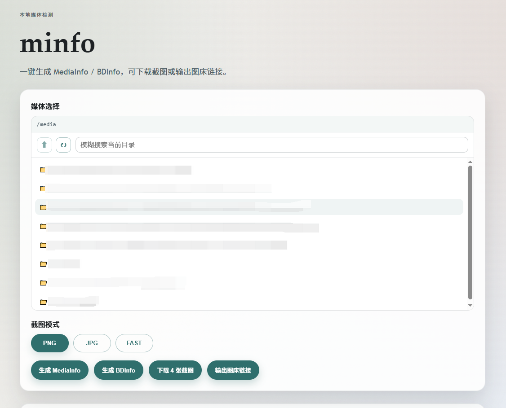

## 项目介绍

`minfo` 是一个本地媒体信息检测 Web 工具，主要功能：
- 输出 MediaInfo 信息
- 输出 BDInfo 信息
- 使用 guyuan 截图脚本
- 支持图床链接生成



## 与原版 minfo 的差异

本项目基于 [minfo](https://github.com/mirrorb/minfo) 进行了多项改进和优化：

### 功能增强

#### 1. 截图功能
- **字幕模式控制**：支持"挂载字幕"和"纯净截图"两种模式
- **预生成下载**：截图 ZIP 先生成并返回下载链接，支持浏览器原生下载
- **结构化日志**：返回脚本执行的详细日志，方便排查问题
- **移除 fast 变体**：简化为 PNG 和 JPG 两种模式

#### 2. BDInfo 优化
- **输出精简**：支持"精简报告"（提取 [code] 块）和"完整报告"两种模式
- **工作目录修复**：在源文件所在目录执行 BDInfo，解决相对路径问题

### 前端体验改进
- **输出面板分离**：MediaInfo/BDInfo 文本输出和图床链接分别显示
- **图床链接管理**：支持链接预览、去重、删除、复制 BBCode
- **状态持久化**：使用 localStorage 保存用户配置，刷新页面不丢失
- **通知提示**：操作结果和错误通过右上角 toast 提示
- **响应式设计**：适配不同屏幕尺寸

### 后端稳定性
- **ffprobe 增强**：双重 fallback（format → stream）和多行解析，支持更多格式
- **文件上传安全**：文件名清理和临时目录隔离，防止路径遍历攻击
- **脚本本地化**：截图脚本纳入版本控制，构建不再依赖外部网络
- **CJK 字体支持**：内置中文字体，确保字幕正确渲染

### 部署与配置
- **多路径挂载**：支持挂载多个独立的媒体目录（/media_path1, /media_path2 等）
- **远程部署**：新增 run-remote-release.sh 脚本，一键部署到远程服务器
- **端口调整**：默认端口从 28080 改为 38080，避免冲突
- **构建代理**：支持配置 HTTP/HTTPS 代理用于 Docker 构建

### 最新合并功能（2024-04-01）

以下功能已从原版最新代码合并：

1. **截图数量自定义**：支持 1-10 张截图数量自定义（新增前端选择器）
2. **BDMV 字幕探测**：新增 bdsub 工具用于蓝光原盘字幕信息探测
3. **FAST 变体移除**：简化截图模式为 PNG 和 JPG 两种
4. **构建代理支持**：支持配置 HTTP/HTTPS 代理用于 Docker 构建

## 部署方式

直接使用已发布镜像 `ghcr.io/mirrorb/minfo:latest`。

示例 `docker-compose.yml`：

```yaml
services:
  minfo:
    image: ghcr.io/mirrorb/minfo:latest
    container_name: minfo
    privileged: true
    ports:
      - "28080:28080"
    environment:
      PORT: "28080"
      WEB_USERNAME: "admin"
      WEB_PASSWORD: "passpass" # 请修改默认用户名密码
      REQUEST_TIMEOUT: "20m"
    volumes:
      - /lib/modules:/lib/modules:ro # 用于挂载ISO
      - /your/media/path1:/media_path1:ro
      - /your/media/path2:/media_path2:ro
      # 可以添加更多挂载路径
    restart: unless-stopped
```

**多路径挂载说明**：
- 支持挂载多个独立的媒体目录
- 容器内路径格式为 `/media_path1`、`/media_path2` 等
- 每个路径都可以独立访问和浏览

启动：

```bash
docker compose up -d
```

## 远程部署

支持通过 SSH 一键部署到远程服务器：

1. 在 `.env` 文件中配置远程服务器信息：
   ```
   REMOTE_SSH_HOST=your-server-ip
   REMOTE_SSH_USER=root
   REMOTE_DEPLOY_DIR=/opt/minfo
   ```

2. 执行部署脚本：
   ```bash
   ./scripts/run-remote-release.sh
   ```

## 常见问题

**问题**：Web 界面显示"读取路径失败"

**原因**：路径不存在或权限问题

**解决**：
1. 检查挂载路径是否正确
2. 检查宿主机目录权限：`ls -la /path/to/media`
3. 确保容器有读取权限（使用 `:ro` 只读挂载）

**问题**：截图中字幕显示为方块

**原因**：缺少中文字体

**解决**：使用最新镜像，已内置 CJK 字体

## 更新日志

### [Unreleased]

#### 新增功能
- 截图数量自定义功能：支持 1-10 张截图数量自定义
- BDMV 字幕探测工具：新增 bdsub 工具用于蓝光原盘字幕信息探测
- 多路径挂载支持：支持挂载多个独立的媒体目录
- 构建代理支持：支持配置 HTTP/HTTPS 代理用于 Docker 构建
- 截图数量选择器组件：前端新增截图数量选择功能

#### 变更
- 移除 FAST 截图变体选项，简化为 PNG 和 JPG 两种模式
- 更新 README 文档，添加与原版 minfo 的差异说明
- 优化配置文件结构，支持更灵活的部署配置

#### 修复
- 修复截图数量固定为 4 张的限制
- 改进多路径挂载的文档说明

### [1.0.0] - 2024-01-01

#### 新增功能
- MediaInfo 信息输出功能
- BDInfo 信息输出功能
- 截图生成功能（PNG/JPG）
- 图床链接生成功能
- 字幕模式控制（挂载字幕/纯净截图）
- BDInfo 输出精简模式
- 前端界面优化
  - 输出面板分离
  - 图床链接管理
  - 状态持久化
  - 通知提示
  - 响应式设计
- 后端稳定性改进
  - ffprobe 增强
  - 文件上传安全
  - 脚本本地化
  - CJK 字体支持
- 远程部署功能

#### 安全改进
- 文件名清理和临时目录隔离，防止路径遍历攻击
