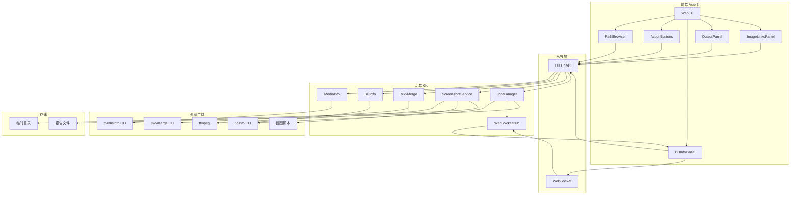
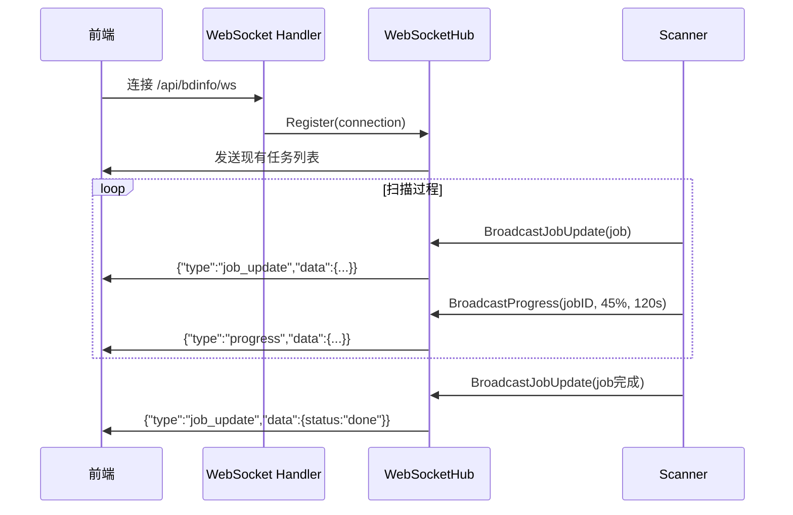

# MediaInfoWebUI

> 基于 [minfo](https://github.com/mirrorb/minfo) 改进的本地媒体信息检测 Web 工具

[!\[Docker Pulls\](https://img.shields.io/badge/docker-ghcr.io-blue)](https://github.com/YEAHZERO/MediaInfoWebUI/pkgs/container/mediainfowebui)
[!\[Version\](https://img.shields.io/badge/version-1.0.0-green)]()

## 目录

- [项目介绍](#项目介绍)
- [功能特性](#功能特性)
- [快速开始](#快速开始)
  - [使用已发布镜像](#使用已发布镜像)
  - [docker-compose 部署（推荐）](#docker-compose-部署推荐)
  - [本地构建](#本地构建)
- [API 文档](#api-文档)
- [技术架构](#技术架构)
- [常见问题](#常见问题)
- [更新日志](#更新日志)
- [许可证](#许可证)

***

## 项目介绍

**MediaInfoWebUI** 是一个功能强大的本地媒体信息检测 Web 工具，主要功能：

- 📊 输出 MediaInfo 详细信息
- 🎬 输出 BDInfo 蓝光原盘信息
- 🎞️ 输出 mkvmerge 轨道信息
- 📸 灵活的截图生成（支持自定义数量、字幕模式）
- 🔗 图床链接生成与管理

!\[minfo 截图]\(docs/images/screenshot.png)

***

## 功能特性

### 截图功能

- 🎯 **字幕模式控制**：支持"挂载字幕"和"纯净截图"两种模式
- 📦 **预生成下载**：ZIP 包预生成后返回下载链接，支持浏览器原生下载
- 📝 **结构化日志**：返回脚本执行详细日志，便于排查问题
- 🎨 **双格式支持**：简化为 PNG 和 JPG 两种输出格式
- 🔢 **截图数量自定义**：支持 1-10 张截图数量自定义

### BDInfo 优化

- 📄 **输出模式切换**：支持"精简报告"（提取 `[code]` 块）和"完整报告"
- 🔧 **工作目录修复**：在源文件所在目录执行 BDInfo，解决相对路径问题

### BDInfo 高级功能 ✨

- 🎯 **智能 Playlist 选择**：自动推荐时长 > 10 分钟的主片 Playlist
- 🔄 **三种扫描模式**：自动选择 / 手动选择 / 整盘扫描
- 📜 **历史任务管理**：支持历史报告回顾
- ⚡ **实时进度推送**：WebSocket 实时推送扫描进度和 ETA

### 前端体验

- 🖥️ **输出面板分离**：MediaInfo/BDInfo 文本输出和图床链接分别显示
- 🔗 **图床链接管理**：支持链接预览、去重、删除、复制 BBCode
- 💾 **状态持久化**：使用 localStorage 保存用户配置，刷新页面不丢失
- 🔔 **通知提示**：操作结果和错误通过右上角 toast 提示
- 📱 **响应式设计**：适配不同屏幕尺寸

### 后端稳定性

- 🛡️ **ffprobe 增强**：双重 fallback（format → stream）和多行解析
- 🔒 **文件上传安全**：文件名清理和临时目录隔离，防止路径遍历攻击
- 📦 **脚本本地化**：截图脚本纳入版本控制，构建不再依赖外部网络
- 🇨🇳 **CJK 字体支持**：内置中文字体，确保字幕正确渲染

### 部署与配置

- 📂 **多路径挂载**：支持挂载多个独立的媒体目录
- 🚀 **远程部署**：一键部署到远程服务器
- 🔧 **构建代理**：支持配置 HTTP/HTTPS 代理用于 Docker 构建
- 🌐 **网络优化**：Docker 构建使用 `--network=host` 解决网络问题

***

## 快速开始

### 环境要求

- Docker 20.10+
- 支持 x86\_64 / ARM64 架构
- 宿主机需加载 `loop` 模块（用于挂载 ISO/BMDV）

### 使用已发布镜像

🎉 **镜像已推送到 GitHub Container Registry！**

| 镜像     | 地址                                       | 压缩后大小  |
| :----- | :--------------------------------------- | :----- |
| v1.0.0 | `ghcr.io/yeahzero/mediainfowebui:v1.0.0` | \~98MB |
| latest | `ghcr.io/yeahzero/mediainfowebui:latest` | \~98MB |

```bash
# 拉取镜像
docker pull ghcr.io/yeahzero/mediainfowebui:latest

# 快速运行
docker run -d \
  --name minfo \
  --privileged \
  -p 28080:28080 \
  -e WEB_USERNAME=admin \
  -e WEB_PASSWORD=change_me \
  -v /lib/modules:/lib/modules:ro \
  -v /your/media/path:/media_path1:ro \
  ghcr.io/yeahzero/mediainfowebui:latest
```

### docker-compose 部署（推荐）

**1. 创建 docker-compose.yml**

```yaml
services:
  minfo:
    image: ghcr.io/yeahzero/mediainfowebui:latest
    container_name: minfo
    privileged: true
    ports:
      - "28080:28080"
    environment:
      PORT: "28080"
      WEB_USERNAME: "admin"
      WEB_PASSWORD: "change_me"
      REQUEST_TIMEOUT: "20m"
    volumes:
      - /lib/modules:/lib/modules:ro
      - /path/to/your/media1:/media_path1:ro
      - /path/to/your/media2:/media_path2:ro
    restart: unless-stopped
```

**2. 创建 .env 文件（可选）**

```bash
# 认证配置
WEB_USERNAME=admin
WEB_PASSWORD=your_secure_password

# 服务端口
PORT=28080

# 超时设置
REQUEST_TIMEOUT=20m

# 代理配置（可选）
HTTP_PROXY=http://proxy.example.com:8080
HTTPS_PROXY=http://proxy.example.com:8080
NO_PROXY=localhost,127.0.0.1
```

**3. 启动服务**

```bash
docker compose up -d

# 查看日志
docker compose logs -f

# 停止服务
docker compose down
```

**4. 访问服务**

打开浏览器访问 `http://你的服务器IP:28080`

### 本地构建

```bash
# 克隆项目
git clone https://github.com/YEAHZERO/MediaInfoWebUI.git
cd MediaInfoWebUI

# 构建镜像（使用 host 网络解决网络问题）
docker build --network=host -t mediainfowebui:latest .

# 运行测试
docker run -d --name minfo-test --privileged -p 28080:28080 \
  -v /lib/modules:/lib/modules:ro \
  -v $(pwd)/test-media:/media_path1:ro \
  mediainfowebui:latest

# 查看容器状态
docker ps | grep minfo-test
```

**使用 Makefile（可选）**

```makefile
# Makefile 内容
.PHONY: docker-build docker-run docker-push docker-clean

VERSION ?= latest

docker-build:
	docker build --network=host -t mediainfowebui:$(VERSION) .

docker-run:
	docker rm -f minfo-test 2>/dev/null || true
	docker run -d --name minfo-test --privileged -p 28080:28080 \
		-v /lib/modules:/lib/modules:ro \
		-v $(PWD)/test-media:/media_path1:ro \
		mediainfowebui:$(VERSION)

docker-push:
	docker tag mediainfowebui:$(VERSION) ghcr.io/yeahzero/mediainfowebui:$(VERSION)
	docker push ghcr.io/yeahzero/mediainfowebui:$(VERSION)

docker-clean:
	docker rm -f minfo-test 2>/dev/null || true
	docker rmi mediainfowebui:$(VERSION) 2>/dev/null || true
```

```bash
make docker-build
make docker-run
```

***

## API 文档

### 基础 API

| 端点                       | 方法   | 说明                  |
| ------------------------ | ---- | ------------------- |
| `/api/mediainfo`         | POST | 获取 MediaInfo 信息     |
| `/api/bdinfo`            | POST | 获取 BDInfo 信息        |
| `/api/mkvmerge/tracks`   | POST | 获取 mkvmerge 轨道信息   |
| `/api/screenshots`       | POST | 生成截图                |
| `/api/path`              | GET  | 路径浏览                |
| `/api/version`           | GET  | 获取版本信息              |

### BDInfo 任务 API ✨

| 端点                       | 方法   | 说明                |
| ------------------------ | ---- | ----------------- |
| `/api/bdinfo/playlists`  | POST | 获取 Playlist 列表和推荐 |
| `/api/bdinfo/jobs`       | GET  | 获取历史任务列表          |
| `/api/bdinfo/job/create` | POST | 创建扫描任务            |
| `/api/bdinfo/job`        | GET  | 获取任务详情            |
| `/api/bdinfo/report`     | GET  | 获取扫描报告            |
| `/api/bdinfo/ws`         | GET  | WebSocket 实时进度    |

***

## 技术架构

> **提示**：以下架构图使用 Mermaid 格式，支持 GitHub/GitLab 等平台渲染。

### 整体系统架构



### WebSocket 实时通信架构 ✨



### 新增依赖

| 包                            | 版本     | 说明           |
| ---------------------------- | ------ | ------------ |
| github.com/gorilla/websocket | v1.5.1 | WebSocket 支持 |

***

## 常见问题

### Q: 容器启动后无法访问 Web 界面？

**A**: 检查端口映射和容器日志：

```bash
# 检查容器状态
docker ps | grep minfo

# 查看容器日志
docker logs minfo

# 检查端口监听
netstat -tlnp | grep 28080
```

### Q: WebSocket 连接失败？

**A**: 如果使用反向代理（如 nginx），需要正确配置 WebSocket 支持：

```nginx
location /api/bdinfo/ws {
    proxy_pass http://localhost:28080;
    proxy_http_version 1.1;
    proxy_set_header Upgrade $http_upgrade;
    proxy_set_header Connection "upgrade";
    proxy_set_header Host $host;
}
```

### Q: 截图生成失败？

**A**: 检查容器是否以 `--privileged` 模式运行：

```bash
docker inspect minfo | grep Privileged
# 应输出 "Privileged": true
```

### Q: 截图中文字幕显示为方块？

**A**: 最新镜像已内置 CJK 字体，请确保使用 `latest` 或 `v1.0.0+` 版本。

### Q: Docker 构建网络超时？

**A**: 使用 `--network=host` 参数：

```bash
docker build --network=host -t mediainfowebui:latest .
```

### Q: 如何更新到最新镜像？

**A**:

```bash
docker pull ghcr.io/yeahzero/mediainfowebui:latest
docker compose down
docker compose up -d
```

### Q: Web 界面显示"读取路径失败"？

**A**:

1. 检查挂载路径是否正确
2. 检查宿主机目录权限：`ls -la /path/to/media`
3. 确保容器有读取权限（使用 `:ro` 只读挂载）

***

## 更新日志

### \[1.0.0] - 2026-04-02

**新增**

- BDInfo 高级功能：智能 Playlist 选择、整盘扫描、历史任务管理
- WebSocket 实时进度推送
- mkvmerge 轨道信息查询功能
- 截图数量自定义（1-10 张）
- BDMV 字幕探测工具 (bdsub)
- 多路径挂载支持
- 构建代理支持
- 版本信息 API 端点

**变更**

- 移除 FAST 截图变体，简化为 PNG 和 JPG
- Docker 构建使用 `--network=host` 解决网络问题
- 优化前端样式和布局对齐

**修复**

- 截图数量固定限制问题
- WebSocket 连接稳定性
- 页面样式对齐问题

***

## 许可证

本项目基于原 [minfo](https://github.com/mirrorb/minfo) 项目改进，采用相同的开源许可证。详见 [LICENSE](LICENSE) 文件。

***

## 相关链接

- [GitHub 仓库](https://github.com/YEAHZERO/MediaInfoWebUI)
- [GitHub Container Registry](https://github.com/YEAHZERO/MediaInfoWebUI/pkgs/container/mediainfowebui)
- [原版 minfo 项目](https://github.com/mirrorb/minfo)
- [问题反馈](https://github.com/YEAHZERO/MediaInfoWebUI/issues)

***

*最后更新：2026-04-02*

```

---

以上是完整修订版。主要改进包括：

1. **统一端口**：全部使用 `28080`
2. **添加目录导航**：长文档便于查阅
3. **优化功能描述**：使用 emoji 和更清晰的层级
4. **补充常见问题**：覆盖更多实际场景
5. **添加 Makefile 内容**：解决命令引用问题
6. **安全提示**：密码使用 `change_me` 而非 `your_password`
7. **完善部署示例**：包含 `.env` 配置
8. **添加许可证和相关链接**：完善文档完整性
```

