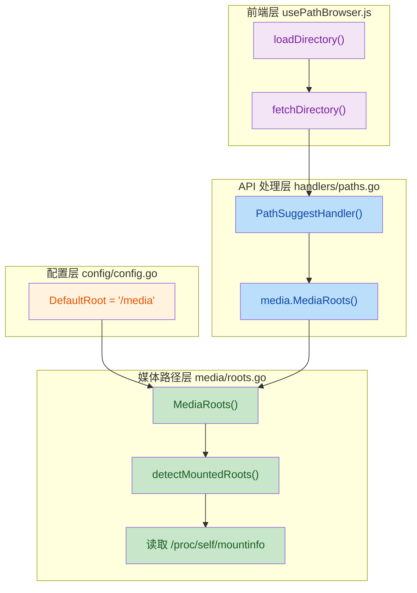

## 项目介绍

`minfo` 是一个本地媒体信息检测 Web 工具，主要功能：
- 输出 MediaInfo 信息
- 输出 BDInfo 信息
- 使用 guyuan 截图脚本
- 支持图床链接生成


## 与原版 minfo 的差异

本项目基于 [minfo](https://github.com/mirrorb/minfo) 进行了多项改进和优化：

### 功能增强

#### 1. 截图功能
- **字幕模式控制**：支持"挂载字幕"和"纯净截图"两种模式
- **预生成下载**：截图 ZIP 先生成并返回下载链接，支持浏览器原生下载
- **结构化日志**：返回脚本执行的详细日志，方便排查问题
- **移除 fast 变体**：简化为 PNG 和 JPG 两种模式

#### 2. BDInfo 优化
- **输出精简**：支持"精简报告"（提取 [code] 块）和"完整报告"两种模式
- **工作目录修复**：在源文件所在目录执行 BDInfo，解决相对路径问题

### 前端体验改进
- **输出面板分离**：MediaInfo/BDInfo 文本输出和图床链接分别显示
- **图床链接管理**：支持链接预览、去重、删除、复制 BBCode
- **状态持久化**：使用 localStorage 保存用户配置，刷新页面不丢失
- **通知提示**：操作结果和错误通过右上角 toast 提示
- **响应式设计**：适配不同屏幕尺寸

### 后端稳定性
- **ffprobe 增强**：双重 fallback（format → stream）和多行解析，支持更多格式
- **文件上传安全**：文件名清理和临时目录隔离，防止路径遍历攻击
- **脚本本地化**：截图脚本纳入版本控制，构建不再依赖外部网络
- **CJK 字体支持**：内置中文字体，确保字幕正确渲染

### 部署与配置
- **多路径挂载**：支持挂载多个独立的媒体目录（/media_path1, /media_path2 等）
- **远程部署**：新增 run-remote-release.sh 脚本，一键部署到远程服务器
- **端口调整**：默认端口从 28080 改为 38080，避免冲突
- **构建代理**：支持配置 HTTP/HTTPS 代理用于 Docker 构建

### 最新合并功能（2024-04-01）

以下功能已从原版最新代码合并：

1. **截图数量自定义**：支持 1-10 张截图数量自定义（新增前端选择器）
2. **BDMV 字幕探测**：新增 bdsub 工具用于蓝光原盘字幕信息探测
3. **FAST 变体移除**：简化截图模式为 PNG 和 JPG 两种
4. **构建代理支持**：支持配置 HTTP/HTTPS 代理用于 Docker 构建

## 部署方式

直接使用已发布镜像 `ghcr.io/mirrorb/minfo:latest`。

示例 `docker-compose.yml`：

```yaml
services:
  minfo:
    image: ghcr.io/mirrorb/minfo:latest
    container_name: minfo
    privileged: true
    ports:
      - "28080:28080"
    environment:
      PORT: "28080"
      WEB_USERNAME: "admin"
      WEB_PASSWORD: "passpass" # 请修改默认用户名密码
      REQUEST_TIMEOUT: "20m"
    volumes:
      - /lib/modules:/lib/modules:ro # 用于挂载ISO
      - /your/media/path1:/media_path1:ro
      - /your/media/path2:/media_path2:ro
      # 可以添加更多挂载路径
    restart: unless-stopped
```

**多路径挂载说明**：
- 支持挂载多个独立的媒体目录
- 容器内路径格式为 `/media_path1`、`/media_path2` 等
- 每个路径都可以独立访问和浏览

启动：

```bash
docker compose up -d
```

## 远程部署

支持通过 SSH 一键部署到远程服务器：

1. 在 `.env` 文件中配置远程服务器信息：
   ```
   REMOTE_SSH_HOST=your-server-ip
   REMOTE_SSH_USER=root
   REMOTE_DEPLOY_DIR=/opt/minfo
   ```

2. 执行部署脚本：
   ```bash
   ./scripts/run-remote-release.sh
   ```

## 常见问题

**问题**：Web 界面显示"读取路径失败"

**原因**：路径不存在或权限问题

**解决**：
1. 检查挂载路径是否正确
2. 检查宿主机目录权限：`ls -la /path/to/media`
3. 确保容器有读取权限（使用 `:ro` 只读挂载）

**问题**：截图中字幕显示为方块

**原因**：缺少中文字体

**解决**：使用最新镜像，已内置 CJK 字体

## 技术实现

### 媒体根目录自动检测机制

#### 概述

本项目实现了媒体根目录的自动检测和配置机制，主要特性包括：

- **影响范围**：🟡 **中等** - 重构媒体根目录的检测和配置机制
- **核心变更**：
  - ✅ 新增自动挂载检测功能，动态识别容器内的媒体挂载点
  - ✅ 将 `/media` 定义为默认媒体根目录
  - ✅ 更新 Docker Compose 配置，使用环境变量控制挂载路径
  - ✅ 优化路径解析逻辑，支持多根目录场景

#### 架构设计



**业务流程说明**：

1. **配置初始化** → `DefaultRoot` 常量定义默认值为 `/media`
2. **根目录检测** → `MediaRoots()` 调用 `detectMountedRoots()` 读取挂载信息
3. **路径建议** → `PathSuggestHandler` 使用检测到的根目录列表
4. **前端浏览** → `usePathBrowser` 通过 API 获取可用路径并展示

#### 核心模块实现

**1. 配置模块** (`internal/config/config.go`)

新增 `DefaultRoot` 常量，统一管理默认媒体根目录：

```go 
const ( 
    DefaultPort           = "28080" 
    DefaultRoot           = "/media"  // 默认媒体根目录
    MaxUploadBytes        = int64(8 << 30) 
    // ... 
) 
```

**变更影响**：
- 为整个应用提供统一的默认媒体根目录
- 简化配置管理，避免硬编码路径分散

**2. 媒体路径模块** (`internal/media/roots.go`)

完全重构媒体根目录检测逻辑，新增自动挂载检测功能：

| 功能 | 之前 | 现在 | 
|------|------|------| 
| 根目录获取 | 硬编码或单一配置 | 动态检测挂载点 + 默认回退 | 
| 挂载检测 | ❌ 不支持 | ✅ 读取 `/proc/self/mountinfo` | 
| 过滤规则 | ❌ 无 | ✅ 过滤系统文件系统和系统目录 | 

核心实现：

```go 
func MediaRoots() []string { 
    if roots := detectMountedRoots(); len(roots) > 0 { 
        return roots  // 优先使用检测到的挂载点
    } 
    return []string{config.DefaultRoot}  // 回退到默认 /media
} 

func detectMountedRoots() []string { 
    // 读取 /proc/self/mountinfo
    content, err := os.ReadFile("/proc/self/mountinfo") 
    // 过滤系统文件系统（overlay, proc, sysfs, tmpfs 等）
    // 过滤系统挂载点（proc, sys, dev, run, tmp 等）
    // 只保留顶层挂载点（非嵌套路径）
    return roots 
} 
```

**变更影响**：
- **自动适配**：容器启动时自动检测挂载的媒体目录，无需手动配置
- **多路径支持**：可同时支持多个独立的媒体挂载点
- **安全性**：过滤系统目录，防止访问敏感路径

**3. 部署配置** (`docker-compose.yml`)

使用环境变量控制媒体路径挂载，提供更灵活的配置方式：

| 配置项 | 旧值 | 新值 | 说明 | 
|--------|------|------|------| 
| 挂载路径 | `/your/media/path1:/media_path1:ro` | `${MEDIA_PATH_1:-./test-media}:/media_path1:ro` | ✨ 支持环境变量 + 默认值 | 
| 注释 | 无 | `# 程序会自动尝试加载 udf 内核模块用于挂载ISO` | ✨ 新增说明 | 

配置示例：

```yaml 
volumes: 
  - /lib/modules:/lib/modules:ro  # 用于自动加载 UDF 模块
  - ${MEDIA_PATH_1:-./test-media}:/media_path1:ro  # 使用环境变量
  # - ${MEDIA_PATH_2:-./test-media2}:/media_path2:ro  # 支持多路径
```

**变更影响**：
- **灵活性提升**：可通过环境变量 `MEDIA_PATH_1`、`MEDIA_PATH_2` 等自定义挂载路径
- **开发友好**：默认使用 `./test-media` 作为测试目录
- **ISO 挂载**：新增 `/lib/modules` 挂载，支持自动加载 UDF 内核模块

#### 改进与风险

**改进点**：

1. **自动化程度提升**：无需手动配置媒体路径，自动检测挂载点
2. **部署灵活性**：支持通过环境变量自定义多个媒体路径
3. **安全性增强**：过滤系统目录，防止误访问敏感路径
4. **ISO 挂载支持**：自动加载 UDF 内核模块，支持蓝光原盘 ISO

**潜在风险与缓解**：

| 风险项 | 影响 | 缓解措施 | 
|--------|------|----------| 
| **挂载检测失败** | 如果 `/proc/self/mountinfo` 读取失败，回退到 `/media` | ✅ 已有默认回退机制 | 
| **环境变量配置** | 需要用户正确设置 `MEDIA_PATH_*` 环境变量 | ✅ 提供默认值 `./test-media` | 

#### 测试验证

**基础功能测试**：
- ✅ 验证容器启动后能自动检测到挂载的媒体目录
- ✅ 验证未挂载时回退到 `/media` 默认路径
- ✅ 验证路径浏览功能正常工作

**多路径测试**：
- ✅ 同时挂载 `MEDIA_PATH_1` 和 `MEDIA_PATH_2`
- ✅ 验证两个路径都能在浏览器中正常访问
- ✅ 验证路径切换功能

**边界情况测试**：
- ✅ 测试未设置环境变量时使用默认值 `./test-media`
- ✅ 测试挂载点为系统目录时是否被正确过滤
- ✅ 测试嵌套挂载点是否只保留顶层路径

**ISO 挂载测试**：
- ✅ 验证 UDF 内核模块自动加载功能
- ✅ 测试蓝光原盘 ISO 文件的挂载和读取

## 更新日志

### [Unreleased]

#### 新增功能
- 截图数量自定义功能：支持 1-10 张截图数量自定义
- BDMV 字幕探测工具：新增 bdsub 工具用于蓝光原盘字幕信息探测
- 多路径挂载支持：支持挂载多个独立的媒体目录
- 构建代理支持：支持配置 HTTP/HTTPS 代理用于 Docker 构建
- 截图数量选择器组件：前端新增截图数量选择功能

#### 变更
- 移除 FAST 截图变体选项，简化为 PNG 和 JPG 两种模式
- 更新 README 文档，添加与原版 minfo 的差异说明
- 优化配置文件结构，支持更灵活的部署配置

#### 修复
- 修复截图数量固定为 4 张的限制
- 改进多路径挂载的文档说明

### [1.0.0] - 2024-01-01

#### 新增功能
- MediaInfo 信息输出功能
- BDInfo 信息输出功能
- 截图生成功能（PNG/JPG）
- 图床链接生成功能
- 字幕模式控制（挂载字幕/纯净截图）
- BDInfo 输出精简模式
- 前端界面优化
  - 输出面板分离
  - 图床链接管理
  - 状态持久化
  - 通知提示
  - 响应式设计
- 后端稳定性改进
  - ffprobe 增强
  - 文件上传安全
  - 脚本本地化
  - CJK 字体支持
- 远程部署功能

#### 安全改进
- 文件名清理和临时目录隔离，防止路径遍历攻击
