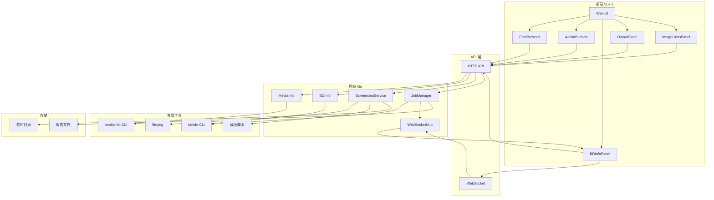
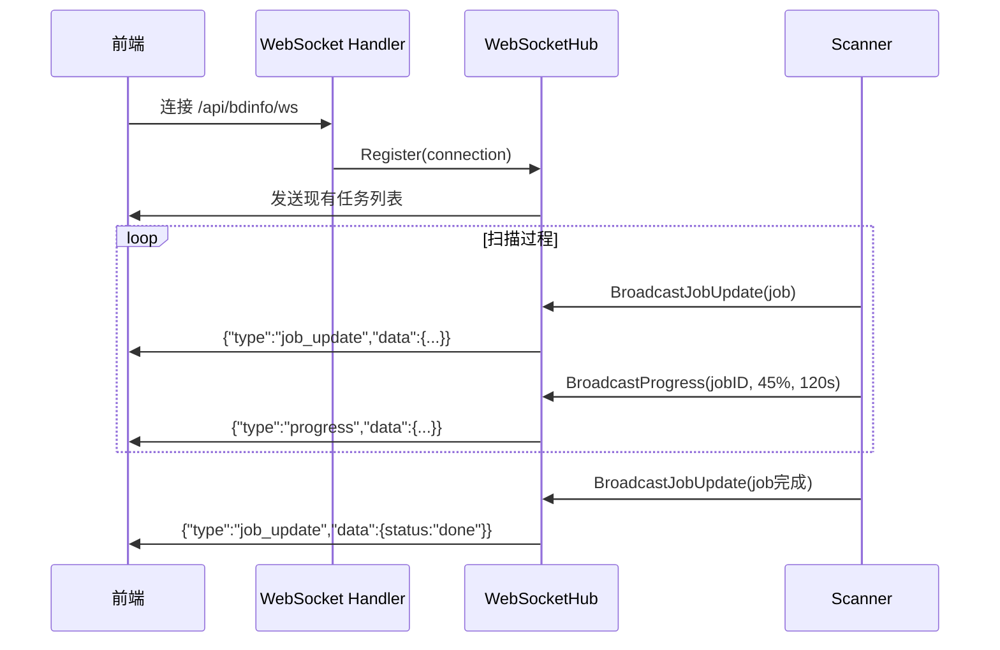

## 项目介绍

`minfo` 是一个本地媒体信息检测 Web 工具，主要功能：

- 输出 MediaInfo 信息
- 输出 BDInfo 信息
- 使用 guyuan 截图脚本
- 支持图床链接生成


## 3. 详细变更分析

### 📦 组件 1: BDInfo 任务管理系统

**变更说明**: 实现了完整的 BDInfo 任务队列和状态管理,支持任务创建、排队、执行和进度追踪。

**关键文件**: `internal/bdinfo/job.go`

| 功能 | 说明 |
|------|------|
| **任务状态** | `queued` (排队) → `running` (运行中) → `done` (完成) / `error` (错误) |
| **任务队列** | 最大支持 100 个任务,FIFO 队列管理 |
| **扫描模式** | `auto` (自动选择) / `playlists` (手动选择) / `whole` (整盘扫描) |
| **实时推送** | 通过 WebSocket 广播任务状态更新 |

**代码片段**:
```go
type Job struct {
    ID             string      `json:"id"`
    Path           string      `json:"path"`
    Status         JobStatus   `json:"status"`
    Progress       float64     `json:"progress"`
    ETASec         int         `json:"etaSec,omitempty"`
    ScanMode       string      `json:"scanMode,omitempty"`
    SelectedMpls   []string    `json:"selectedMpls,omitempty"`
}
```

---

### 🧠 组件 2: Playlist 智能推荐算法

**变更说明**: 自动分析蓝光碟片中的 Playlist,推荐时长 > 10 分钟的主片。

**关键文件**: `internal/bdinfo/playlist.go`

| 推荐策略 | 条件 | 说明 |
|---------|------|------|
| **单文件推荐** | 时长 ≥ 10 分钟 | 选择文件大小最大的 Playlist |
| **整盘扫描** | 无符合条件的 Playlist | 扫描整个 BD 目录 |
| **手动选择** | 用户自定义 | 支持多选 Playlist |

**代码片段**:
```go
func RecommendPlaylists(playlists []Playlist) *Selection {
    // 过滤时长 ≥ 10 分钟的 Playlist
    filtered := make([]Playlist, 0)
    for _, p := range usable {
        if p.LengthSeconds >= minPlaylistDurationSeconds {
            filtered = append(filtered, p)
        }
    }
    
    // 按文件大小排序,选择最大的
    sort.Slice(filtered, func(i, j int) bool {
        return filtered[i].SizeBytes > filtered[j].SizeBytes
    })
    
    return &Selection{
        Mode:   "single",
        Mpls:   []string{largest.Name},
        Reason: "largest-size-over-10min",
    }
}
```

---

### 🔌 组件 3: WebSocket 实时推送

**变更说明**: 实现了 WebSocket Hub,支持实时推送任务状态、进度和 ETA。

**关键文件**: `internal/bdinfo/websocket.go`

| 消息类型 | 数据内容 | 用途 |
|---------|---------|------|
| `job_update` | 完整 Job 对象 | 任务状态变更 |
| `progress` | `progress`, `etaSec` | 扫描进度更新 |
| `ping` | Unix 时间戳 | 保持连接活跃 |

**特性**:
- 支持构建标签 `websocket` 控制是否启用
- 提供存根实现 (`websocket_stub.go`) 用于无 WebSocket 场景
- 每 30 秒发送 ping 保持连接
- 连接注册时自动推送所有现有任务

---

### 🎨 组件 4: 前端 BDInfo 统一面板

**变更说明**: 新增 `BDInfoPanel.vue` 组件,集成 Playlist 选择、任务进度、历史记录。

**关键文件**: `webui/src/components/BDInfoPanel.vue`

| Tab | 功能 |
|-----|------|
| **扫描** | 选择扫描模式、加载 Playlist、启动扫描 |
| **历史** | 查看历史任务、查看报告、复制摘要 |

**交互流程**:
```
用户选择扫描模式 → 加载 Playlist → 选择 Playlist → 创建任务
→ 切换到历史 Tab → 实时查看进度 → 查看报告/复制摘要
```

---

### 📦 组件 5: 截图功能简化

**变更说明**: 移除 FAST 截图变体,仅保留 PNG 和 JPG 两种模式。

**关键文件**: `webui/src/components/ScreenshotVariantPicker.vue`

| 变体 | 状态 | 说明 |
|------|------|------|
| PNG | ✅ 保留 | 高质量无损格式 |
| JPG | ✅ 保留 | 高速压缩格式 |
| FAST | ❌ 移除 | 已废弃 |

---

### 🚀 组件 6: Docker 镜像发布

**变更说明**: 构建并发布 Docker 镜像到 GitHub Container Registry。

| 镜像标签 | 地址 | 大小 |
|---------|------|------|
| v1.0.0 | `ghcr.io/yeahzero/mediainfowebui:v1.0.0` | 321MB (压缩后 98MB) |
| latest | `ghcr.io/yeahzero/mediainfowebui:latest` | 321MB (压缩后 98MB) |

**部署命令**:
```bash
docker pull ghcr.io/yeahzero/mediainfowebui:latest

docker run -d \
  --name minfo \
  --privileged \
  -p 28080:28080 \
  -e WEB_USERNAME=admin \
  -e WEB_PASSWORD=your_password \
  -v /your/media/path:/media_path1:ro \
  ghcr.io/yeahzero/mediainfowebui:latest
```

---

### 📁 组件 7: 媒体路径统一

**变更说明**: 统一使用 `/media` 作为唯一的媒体根目录。

**变更类型**: 路径重构

| 旧路径 | 新路径 | 说明 |
|--------|--------|------|
| `/media_path1`, `/media_path2` | `/media` | 统一根目录 |
| 多路径挂载 | 单路径挂载 | 简化配置 |

---

## 4. 影响与风险评估

### ⚠️ 破坏性变更

| 变更项 | 影响 | 迁移建议 |
|--------|------|---------|
| **媒体路径变更** | 需要重新挂载目录 | 更新 docker-compose.yml 中的 volume 映射 |
| **FAST 变体移除** | 无法使用 FAST 截图 | 切换到 PNG 或 JPG 模式 |
| **端口配置不一致** | README 提到 38080,实际使用 28080 | 统一使用 28080 端口 |

### 🧪 测试建议

1. **BDInfo 扫描测试**:
   - 测试自动选择模式 (验证推荐算法)
   - 测试手动选择模式 (验证多选功能)
   - 测试整盘扫描模式 (验证完整扫描)

2. **WebSocket 连接测试**:
   - 验证实时进度更新
   - 验证多客户端连接
   - 验证断线重连

3. **截图功能测试**:
   - 验证 PNG 和 JPG 模式正常工作
   - 验证字幕模式切换

4. **部署测试**:
   - 验证 Docker 镜像拉取和运行
   - 验证媒体路径挂载正确

---

## 5. 技术亮点

✨ **智能推荐算法**: 自动识别蓝光碟片主片,减少用户手动选择  
🔄 **实时进度推送**: WebSocket 实现任务状态实时同步  
📦 **条件编译**: WebSocket 功能通过构建标签控制,灵活部署  
🎯 **统一界面**: BDInfo 功能集成到单一面板,提升用户体验  
🚀 **镜像发布**: 推送到 GitHub Container Registry,便于部署

---

## 本项目基于 [minfo](https://github.com/mirrorb/minfo) 进行了多项改进和优化：

### 功能增强

#### 1. 截图功能

- **字幕模式控制**：支持"挂载字幕"和"纯净截图"两种模式
- **预生成下载**：截图 ZIP 先生成并返回下载链接，支持浏览器原生下载
- **结构化日志**：返回脚本执行的详细日志，方便排查问题
- **移除 fast 变体**：简化为 PNG 和 JPG 两种模式

#### 2. BDInfo 优化

- **输出精简**：支持"精简报告"（提取 [code] 块）和"完整报告"两种模式
- **工作目录修复**：在源文件所在目录执行 BDInfo，解决相对路径问题

#### 3. BDInfo 高级功能 ✨ 新增

- **智能 Playlist 选择**：自动推荐时长 > 10 分钟的主片 Playlist
- **多种扫描模式**：支持自动选择、手动选择、整盘扫描三种模式
- **历史任务管理**：任务列表可重新查看，支持查看历史报告
- **实时进度推送**：通过 WebSocket 实时显示扫描进度和 ETA

### 前端体验改进

- **输出面板分离**：MediaInfo/BDInfo 文本输出和图床链接分别显示
- **图床链接管理**：支持链接预览、去重、删除、复制 BBCode
- **状态持久化**：使用 localStorage 保存用户配置，刷新页面不丢失
- **通知提示**：操作结果和错误通过右上角 toast 提示
- **响应式设计**：适配不同屏幕尺寸
- **BDInfo 面板** ✨ 新增：集成 Playlist 选择、任务进度、历史记录的统一面板

### 后端稳定性

- **ffprobe 增强**：双重 fallback（format → stream）和多行解析，支持更多格式
- **文件上传安全**：文件名清理和临时目录隔离，防止路径遍历攻击
- **脚本本地化**：截图脚本纳入版本控制，构建不再依赖外部网络
- **CJK 字体支持**：内置中文字体，确保字幕正确渲染
- **WebSocket 支持** ✨ 新增：实时推送任务状态和进度

### 部署与配置

- **多路径挂载**：支持挂载多个独立的媒体目录（/media_path1, /media_path2 等）
- **远程部署**：新增 run-remote-release.sh 脚本，一键部署到远程服务器
- **端口调整**：默认端口从 28080 改为 38080，避免冲突
- **构建代理**：支持配置 HTTP/HTTPS 代理用于 Docker 构建
- **网络优化** ✨ 新增：Docker 构建使用 `--network=host` 解决网络问题

## 部署方式

### 使用已发布镜像

🎉 **镜像已推送到 GitHub Container Registry！**

| 镜像 | 地址 | 大小 |
|------|------|------|
| v1.0.0 | `ghcr.io/yeahzero/mediainfowebui:v1.0.0` | 321MB (压缩后 98MB) |
| latest | `ghcr.io/yeahzero/mediainfowebui:latest` | 321MB (压缩后 98MB) |

### 快速部署

```bash
docker pull ghcr.io/yeahzero/mediainfowebui:latest

docker run -d \
  --name minfo \
  --privileged \
  -p 28080:28080 \
  -e WEB_USERNAME=admin \
  -e WEB_PASSWORD=your_password \
  -v /lib/modules:/lib/modules:ro \
  -v /your/media/path:/media_path1:ro \
  ghcr.io/yeahzero/mediainfowebui:latest
```

### 使用 docker-compose（推荐）

```yaml
services:
  minfo:
    image: ghcr.io/yeahzero/mediainfowebui:latest
    container_name: minfo
    privileged: true
    ports:
      - "28080:28080"
    environment:
      PORT: "28080"
      WEB_USERNAME: "admin"
      WEB_PASSWORD: "your_password"
      REQUEST_TIMEOUT: "20m"
    volumes:
      - /lib/modules:/lib/modules:ro
      - /path/to/your/media1:/media_path1:ro
      - /path/to/your/media2:/media_path2:ro
    restart: unless-stopped
```

启动：
```bash
docker compose up -d
```

## 本地构建

```bash
# 快速构建（使用 host 网络）
make docker-build

# 运行
make docker-run

# 推送
make docker-push

# 清理旧镜像
make docker-clean
```

## API 端点

### 基础 API

| 端点 | 方法 | 说明 |
|------|------|------|
| `/api/mediainfo` | POST | MediaInfo 信息 |
| `/api/bdinfo` | POST | BDInfo 信息 |
| `/api/screenshots` | POST | 截图生成 |
| `/api/path` | GET | 路径浏览 |

### BDInfo 任务 API ✨ 新增

| 端点 | 方法 | 说明 |
|------|------|------|
| `/api/bdinfo/playlists` | POST | 获取 Playlist 列表和推荐 |
| `/api/bdinfo/jobs` | GET | 获取历史任务列表 |
| `/api/bdinfo/job/create` | POST | 创建扫描任务 |
| `/api/bdinfo/job` | GET | 获取任务详情 |
| `/api/bdinfo/report` | GET | 获取扫描报告 |
| `/api/bdinfo/ws` | GET | WebSocket 实时进度 |

## 技术架构

### 整体系统架构



### 核心模块架构

```mermaid
graph TD
    subgraph "前端层 Vue 3"
        subgraph "路径浏览模块"
            PB[PathBrowser.vue]
            UB[usePathBrowser.js]
        end
        subgraph "BDInfo 任务模块"
            BP[BDInfoPanel.vue]
            BJ[useBDInfoJobs.js]
        end
        subgraph "输出模块"
            OP[OutputPanel.vue]
            IL[ImageLinksPanel.vue]
        end
    end
    
    subgraph "API 层"
        subgraph "路径 API"
            PSH[PathSuggestHandler]
        end
        subgraph "BDInfo 任务 API"
            BJH[BDInfoCreateJobHandler]
            BJL[BDInfoListJobsHandler]
            WSH[BDInfoWebSocketHandler]
        end
    end
    
    subgraph "后端服务层"
        subgraph "媒体路径检测"
            MR[MediaRoots]
            DMR[detectMountedRoots]
            CFG["config.DefaultRoot=/media"]
        end
        subgraph "BDInfo 任务队列"
            JM[JobManager]
            SC[Scanner]
            WH[WebSocketHub]
        end
    end
    
    subgraph "外部工具"
        BDI[bdinfo CLI]
        PROC[/proc/self/mountinfo]
    end
    
    subgraph "存储"
        REP[报告文件]
        MEM[内存任务列表]
    end
    
    PB --> UB
    UB --> PSH
    PSH --> MR
    MR --> DMR
    DMR --> PROC
    CFG --> MR
    
    BP --> BJ
    BJ --> BJH
    BJ --> WSH
    BJH --> JM
    WSH --> WH
    JM --> SC
    SC --> BDI
    SC --> WH
    WH --> BJ
    JM --> MEM
    SC --> REP
    
    style PB fill:#f3e5f5,color:#7b1fa2
    style BP fill:#f3e5f5,color:#7b1fa2
    style PSH fill:#bbdefb,color:#0d47a1
    style BJH fill:#bbdefb,color:#0d47a1
    style WSH fill:#bbdefb,color:#0d47a1
    style MR fill:#c8e6c9,color:#1a5e20
    style JM fill:#c8e6c9,color:#1a5e20
    style SC fill:#c8e6c9,color:#1a5e20
    style WH fill:#c8e6c9,color:#1a5e20
    style CFG fill:#fff3e0,color:#e65100
```

**业务流程**：

| 模块 | 流程 |
|------|------|
| **路径检测** | `DefaultRoot=/media` → `MediaRoots()` → 读取 `/proc/self/mountinfo` → 返回可用路径 |
| **BDInfo 任务** | 前端创建任务 → `JobManager` 入队 → `Scanner` 执行 BDInfo CLI → `WebSocketHub` 广播进度 |
| **实时通信** | 前端连接 WebSocket → 接收任务更新/进度 → 显示实时状态 |

### WebSocket 实时通信架构 ✨ 新增



**WebSocket 消息类型**：

| type | 说明 | data |
|------|------|------|
| `job_update` | 任务状态更新 | Job 对象 |
| `progress` | 进度更新 | `{jobId, progress, etaSec}` |
| `ping` | 心跳检测 | 时间戳 |

### 新增依赖

| 包 | 版本 | 说明 |
|---|------|------|
| github.com/gorilla/websocket | v1.5.1 | WebSocket 支持 |

### 新增文件

```
internal/bdinfo/
├── playlist.go      # Playlist 列表和推荐算法
├── job.go           # 任务队列管理
├── scanner.go       # BDInfo 扫描执行器
└── websocket.go     # WebSocket Hub

internal/httpapi/handlers/
└── bdinfo_jobs.go   # BDInfo 任务 API 处理器

webui/src/
├── api/media.js              # API 函数（含 BDInfo 任务）
├── composables/useBDInfoJobs.js  # BDInfo 任务管理
└── components/
    ├── BDInfoPanel.vue       # BDInfo 统一面板
    ├── BDInfoPlaylistPicker.vue  # Playlist 选择器
    ├── BDInfoJobProgress.vue # 任务进度显示
    └── BDInfoJobHistory.vue  # 历史任务列表
```

## 常见问题

**问题**：Web 界面显示"读取路径失败"

**解决**：
1. 检查挂载路径是否正确
2. 检查宿主机目录权限：`ls -la /path/to/media`
3. 确保容器有读取权限（使用 `:ro` 只读挂载）

**问题**：截图中字幕显示为方块

**解决**：使用最新镜像，已内置 CJK 字体

**问题**：Docker 构建网络超时

**解决**：使用 `--network=host` 参数
```bash
docker build --network=host -t minfo:local .
```

## 更新日志

### [v1.0.0] - 2024-04-02

#### 新增功能

- **BDInfo 高级功能**
  - 智能 Playlist 选择（自动推荐时长 > 10min）
  - 整盘扫描支持
  - 历史任务管理
  - WebSocket 实时进度推送
- **截图数量自定义**：支持 1-10 张截图数量自定义
- **BDMV 字幕探测**：新增 bdsub 工具
- **多路径挂载**：支持多个独立媒体目录
- **构建代理**：支持 HTTP/HTTPS 代理

#### 变更

- 移除 FAST 截图变体，简化为 PNG 和 JPG
- 优化 Dockerfile，基于原版镜像只覆盖修改文件
- Docker 构建使用 `--network=host` 解决网络问题

#### 修复

- 修复截图数量固定限制
- 改进多路径挂载文档
- WebSocket 连接稳定性优化
