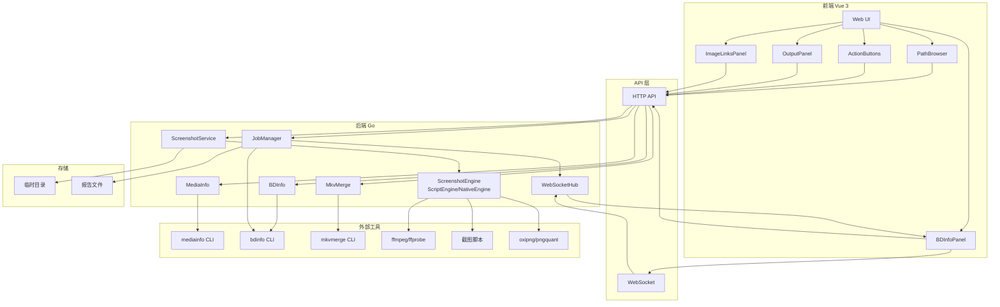
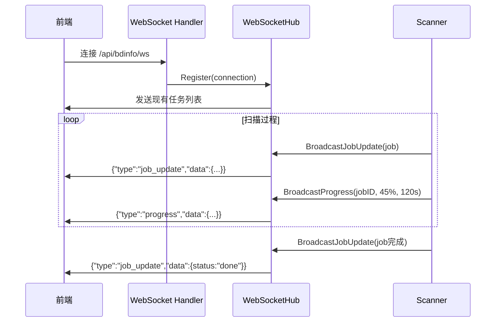

# MediaInfoWebUI

> 基于 [minfo](https://github.com/mirrorb/minfo) 改进的本地媒体信息检测 Web 工具

[](https://github.com/YEAHZERO/MediaInfoWebUI/pkgs/container/mediainfowebui)
[](https://github.com/YEAHZERO/MediaInfoWebUI/releases/tag/v1.4.2)

## 目录

- [项目介绍](#项目介绍)
- [功能特性](#功能特性)
- [快速开始](#快速开始)
  - [方式一：一行命令部署](#方式一一行命令部署快速尝鲜)
  - [方式二：docker-compose 部署](#方式二docker-compose-部署推荐)
  - [方式三：本地构建](#方式三本地构建)
  - [配置参考](#配置参考)
- [API 文档](#api-文档)
- [技术架构](#技术架构)
- [常见问题](#常见问题)
- [服务器更新指南](#服务器更新指南)
- [更新日志](#更新日志)
- [许可证](#许可证)

***

## 项目介绍

**MediaInfoWebUI** 是一个功能强大的本地媒体信息检测 Web 工具，主要功能：

- 📊 输出 MediaInfo 详细信息
- 🎬 输出 BDInfo 蓝光原盘信息
- 🎞️ 输出 mkvmerge 轨道信息（支持自动查找BDMV和m2ts文件）
- 📸 灵活的截图生成（支持自定义数量、字幕模式）
- 🔗 图床链接生成与管理


***

## 功能特性

### 截图功能

- 🎯 **字幕模式控制**：支持"挂载字幕"和"纯净截图"两种模式
- 📦 **预生成下载**：ZIP 包预生成后返回下载链接，支持浏览器原生下载
- 📝 **结构化日志**：返回脚本执行详细日志，便于排查问题
- 🎨 **双格式支持**：简化为 PNG 和 JPG 两种输出格式
- 🔢 **截图数量自定义**：支持 1-10 张截图数量自定义

### 截图引擎（新增 🚀）

- 🎨 **色彩空间检测**：通过 ffprobe 自动检测视频色彩空间（SDR/HDR10/Dolby Vision）
- 🗜️ **截图压缩**：集成 oxipng（无损）和 pngquant（有损）自动压缩
- 🔧 **可插拔引擎架构**：默认使用轻量脚本引擎，可选启用 Go 原生引擎
- 🧩 **引擎工厂模式**：根据环境变量自动选择合适引擎，支持快捷回退

### BDInfo 优化

- 📄 **输出模式切换**：支持"精简报告"（提取 `[code]` 块）和"完整报告"
- 🔧 **工作目录修复**：在源文件所在目录执行 BDInfo，解决相对路径问题
- 🔍 **递归查找**：支持递归查找子目录中的 BDMV 和 ISO 文件

### mkvmerge 轨道信息 🎞️

- 🔍 **智能文件查找**：自动查找 BDMV 目录和最大的 m2ts 文件
- 📁 **递归搜索**：支持在嵌套目录结构中查找视频文件
- 🎯 **多格式支持**：支持 mkv、m2ts、mp4 等多种视频格式
- 📊 **详细轨道信息**：显示视频、音频、字幕轨道详细信息

### BDInfo 高级功能 ✨

- 🎯 **智能 Playlist 选择**：自动推荐时长 > 10 分钟的主片 Playlist
- 🔄 **三种扫描模式**：
  - **自动选择**：自动检测并扫描推荐的 Playlist
  - **手动选择**：加载所有 Playlist 供用户选择
  - **整盘扫描**：扫描整个蓝光目录的所有内容
- 📜 **历史任务管理**：支持历史报告回顾
- ⚡ **实时进度推送**：WebSocket 实时推送扫描进度和 ETA
- 🎨 **交互式界面**：
  - **加载列表**：手动模式下加载 Playlist 列表
  - **全选/清空**：快速选择或取消选择所有 Playlist
  - **推荐**：一键选择系统推荐的 Playlist
  - **主片标记**：自动标记时长 > 10 分钟的主片 Playlist
  - **详细信息**：显示 Playlist 时长、大小等详细信息

### 前端体验

- 🖥️ **输出面板分离**：MediaInfo/BDInfo 文本输出和图床链接分别显示
- 🔗 **图床链接管理**：支持链接预览、去重、删除、复制 BBCode
- 💾 **状态持久化**：使用 localStorage 保存用户配置，刷新页面不丢失
- 🔔 **通知提示**：操作结果和错误通过右上角 toast 提示
- 📱 **响应式设计**：适配不同屏幕尺寸

### 后端稳定性

- 🛡️ **ffprobe 增强**：双重 fallback（format → stream）和多行解析
- 🔒 **文件上传安全**：文件名清理和临时目录隔离，防止路径遍历攻击
- 📦 **脚本本地化**：截图脚本纳入版本控制，构建不再依赖外部网络
- 🇨🇳 **CJK 字体支持**：内置中文字体，确保字幕正确渲染

### 部署与配置

- 📂 **多路径挂载**：支持挂载多个独立的媒体目录
- 🚀 **远程部署**：一键部署到远程服务器
- 🔧 **构建代理**：支持配置 HTTP/HTTPS 代理用于 Docker 构建
- 🌐 **网络优化**：Docker 构建使用 `--network=host` 解决网络问题

***

## 快速开始

### 环境要求

- Docker 20.10+
- 支持 x86\_64 / ARM64 架构
- 宿主机需加载 `loop` 模块（用于挂载 ISO/BDMV）

### 方式一：一行命令部署（快速尝鲜）

```bash
docker run -d \
  --name mediainfo \
  --privileged \
  -p 28888:28888 \
  -e TZ=Asia/Shanghai \
  -e PORT=28888 \
  -e REQUEST_TIMEOUT=30m \
  -v /lib/modules:/lib/modules:ro \
  -v //home/live/qbittorrent/downloads:/media:ro \
  --restart unless-stopped \
  ghcr.io/yeahzero/mediainfowebui:latest
```

### 方式二：docker-compose 部署（推荐）

**1. 创建 docker-compose.yml**

```yaml
services:
  mediainfo:
    image: ghcr.io/yeahzero/mediainfowebui:latest
    container_name: mediainfo
    privileged: true
    ports:
      - "28888:28888"
    environment:
      TZ: "Asia/Shanghai"
      PORT: "28888"
      REQUEST_TIMEOUT: "30m"
      # 截图引擎（可选，详见配置参考）
      # ENABLE_NATIVE_ENGINE: "1"
      # SCREENSHOT_COMPRESS_THRESHOLD: "10485760"
      # SCREENSHOT_COMPRESS_STRATEGY: "auto"
    volumes:
      - /lib/modules:/lib/modules:ro
      - //home/live/qbittorrent/downloads:/media:ro
    restart: unless-stopped
    healthcheck:
      test: ["CMD", "curl", "-f", "http://localhost:28888/api/version"]
      interval: 30s
      timeout: 10s
      retries: 3
```

**2. 启动服务**

```bash
docker compose up -d

# 查看日志
docker compose logs -f

# 停止服务
docker compose down
```

### 方式三：本地构建

```bash
git clone https://github.com/YEAHZERO/MediaInfoWebUI.git
cd MediaInfoWebUI
```

**标准构建（默认 ScriptEngine）**

```bash
docker build --network=host -t mediainfowebui:latest .
```

**全量构建（含 NativeEngine + WebSocket，需要特殊镜像）**

需要先从源码编译带 `-tags native` 的二进制，然后打包进镜像：

```bash
# 1. 编译带 native 支持的二进制（需要 CGO 环境）
CGO_ENABLED=1 go build -tags native -o mediainfo ./cmd/mediainfo

# 2. 打包进 Docker 镜像
docker build --network=host -t mediainfowebui:native .
```

> **网络问题**：如果 Docker 构建报 `failed to create endpoint ... on network bridge: operation not supported`，务必加 `--network=host`。

**运行**（默认无认证，如需认证参考上方配置参考）

```bash
# 标准镜像
docker run -d --name mediainfo --privileged --network host \
  -e TZ=UTC -e PORT=28888 -e REQUEST_TIMEOUT=30m \
  -v /lib/modules:/lib/modules:ro \
  -v /home/live/qbittorrent/downloads:/media:ro \
  --restart unless-stopped \
  mediainfowebui:latest

# 全量镜像（native）
docker rm -f mediainfo 2>/dev/null; docker run -d \
  --name mediainfo \
  --privileged \
  --network host \
  -e TZ=UTC \
  -e PORT=28888 \
  -e REQUEST_TIMEOUT=30m \
  -e ENABLE_NATIVE_ENGINE=1 \
  -e SCREENSHOT_COMPRESS_THRESHOLD=10485760 \
  -e SCREENSHOT_COMPRESS_STRATEGY=auto \
  -v /lib/modules:/lib/modules:ro \
  -v /home/live/qbittorrent/downloads:/media:ro \
  --restart unless-stopped \
  mediainfowebui:native
```

### 访问服务

打开浏览器访问 `http://你的服务器IP:28888`

### 配置参考

| 环境变量                            | 默认值        | 说明                                           |
| ------------------------------- | ---------- | -------------------------------------------- |
| `PORT`                          | `28888`    | 服务端口                                         |
| `TZ`                            | `UTC`      | 时区                                           |
| `REQUEST_TIMEOUT`               | `20m`      | 请求超时（大文件建议 `30m`）                            |
| `ENGINE_TYPE`                   | `script`   | 截图引擎类型：`script`（脚本引擎，轻量）或 `native`（原生引擎，全功能） |
| `ENABLE_NATIVE_ENGINE`          | `0`        | 启用原生截图引擎（等同于 `ENGINE_TYPE=native`）           |
| `SCREENSHOT_COMPRESS_THRESHOLD` | `10485760` | 截图压缩阈值（字节）                                   |
| `SCREENSHOT_COMPRESS_STRATEGY`  | `auto`     | 压缩策略：`lossless`/`lossy`/`auto`               |
| `OXIPNG_BIN`                    | `oxipng`   | oxipng 路径                                    |
| `PNGQUANT_BIN`                  | `pngquant` | pngquant 路径                                  |

***

## API 文档

### 基础 API

| 端点                     | 方法   | 说明               |
| :--------------------- | :--- | :--------------- |
| `/api/mediainfo`       | POST | 获取 MediaInfo 信息  |
| `/api/bdinfo`          | POST | 获取 BDInfo 信息     |
| `/api/mkvmerge/tracks` | POST | 获取 mkvmerge 轨道信息 |
| `/api/screenshots`     | POST | 生成截图             |
| `/api/path`            | GET  | 路径浏览             |
| `/api/version`         | GET  | 获取版本信息           |

### BDInfo 任务 API ✨

| 端点                       | 方法   | 说明                |
| :----------------------- | :--- | :---------------- |
| `/api/bdinfo/playlists`  | POST | 获取 Playlist 列表和推荐 |
| `/api/bdinfo/jobs`       | GET  | 获取历史任务列表          |
| `/api/bdinfo/job/create` | POST | 创建扫描任务            |
| `/api/bdinfo/job`        | GET  | 获取任务详情            |
| `/api/bdinfo/report`     | GET  | 获取扫描报告            |
| `/api/bdinfo/ws`         | GET  | WebSocket 实时进度    |

***

## 技术架构

> **提示**：以下架构图使用 Mermaid 格式，支持 GitHub/GitLab 等平台渲染。

### 整体系统架构


```mermaid
graph TB
    subgraph "前端 Vue 3"
        UI[Web UI]
        PB[PathBrowser]
        AB[ActionButtons]
        BP[BDInfoPanel]
        OP[OutputPanel]
        IL[ImageLinksPanel]
    end
    
    subgraph "API 层"
        API[HTTP API]
        WS[WebSocket]
    end
    
    subgraph "后端 Go"
        MI[MediaInfo]
        BI[BDInfo]
        MK[MkvMerge]
        SS[ScreenshotService]
        SE[ScreenshotEngine<br/>ScriptEngine/NativeEngine]
        JM[JobManager]
        WH[WebSocketHub]
    end
    
    subgraph "外部工具"
        MED[mediainfo CLI]
        BDI[bdinfo CLI]
        MKV[mkvmerge CLI]
        FFM[ffmpeg/ffprobe]
        SCP[截图脚本]
        OXI[oxipng/pngquant]
    end
    
    subgraph "存储"
        TMP[临时目录]
        REP[报告文件]
    end
    
    UI --> PB
    UI --> AB
    UI --> BP
    UI --> OP
    UI --> IL
    
    PB --> API
    AB --> API
    BP --> API
    BP --> WS
    OP --> API
    IL --> API
    
    API --> MI
    API --> BI
    API --> MK
    API --> SS
    API --> JM
    WS --> WH
    
    MI --> MED
    BI --> BDI
    MK --> MKV
    SS --> SE
    SE --> FFM
    SE --> SCP
    SE --> OXI
    JM --> BDI
    
    WH --> BP
    JM --> WH
    JM --> REP
    SS --> TMP
```

### WebSocket 实时通信架构 ✨


```mermaid
sequenceDiagram
    participant F as 前端
    participant W as WebSocket Handler
    participant H as WebSocketHub
    participant S as Scanner
    
    F->>W: 连接 /api/bdinfo/ws
    W->>H: Register(connection)
    H->>F: 发送现有任务列表
    
    loop 扫描过程
        S->>H: BroadcastJobUpdate(job)
        H->>F: {"type":"job_update","data":{...}}
        S->>H: BroadcastProgress(jobID, 45%, 120s)
        H->>F: {"type":"progress","data":{...}}
    end
    
    S->>H: BroadcastJobUpdate(job完成)
    H->>F: {"type":"job_update","data":{status:"done"}}
```

### 新增依赖

| 包                            | 版本     | 说明           |
| :--------------------------- | :----- | :----------- |
| github.com/gorilla/websocket | v1.5.1 | WebSocket 支持 |

***

## 常见问题

### Q: 容器启动后无法访问 Web 界面？

**A**: 检查端口映射和容器日志：

```bash
# 检查容器状态
docker ps | grep mediainfo

# 查看容器日志
docker logs mediainfo

# 检查端口监听
netstat -tlnp | grep 28888
```

### Q: WebSocket 连接失败？

**A**: 如果使用反向代理（如 nginx），需要正确配置 WebSocket 支持：

```nginx
location /api/bdinfo/ws {
    proxy_pass http://localhost:28888;
    proxy_http_version 1.1;
    proxy_set_header Upgrade $http_upgrade;
    proxy_set_header Connection "upgrade";
    proxy_set_header Host $host;
}
```

### Q: 截图生成失败？

**A**: 检查容器是否以 `--privileged` 模式运行：

```bash
docker inspect mediainfo | grep Privileged
# 应输出 "Privileged": true
```

### Q: 截图中文字幕显示为方块？

**A**: 最新镜像已内置 CJK 字体，请确保使用 `latest` 或 `v1.0.0+` 版本。

### Q: Docker 构建网络超时？

**A**: 使用 `--network=host` 参数：

```bash
docker build --network=host -t mediainfowebui:latest .
```

### Q: Web 界面显示"读取路径失败"？

**A**:

1. 检查挂载路径是否正确
2. 检查宿主机目录权限：`ls -la /path/to/media`
3. 确保容器有读取权限（使用 `:ro` 只读挂载）

***

## 服务器更新指南

如果服务器上已有 Go 开发环境（Go 1.22+），可以直接从源码构建和更新：

### 从 GitHub 拉取最新代码

```bash
# 进入项目目录
cd /path/to/MediaInfoWebUI

# 拉取最新代码
git pull origin main

# 查看更新内容
git log --oneline HEAD~10..HEAD
```

### 本地编译构建

```bash
# 安装依赖
go mod tidy

# 标准编译（默认 ScriptEngine，零 CGO 依赖）
go build -o mediainfo ./cmd/mediainfo

# 可选：启用 NativeEngine 编译（需要 CGO + libplacebo-dev）
# go build -tags native -o mediainfo ./cmd/mediainfo

# 验证编译成功
./mediainfo -version
```

### Docker 全量部署（推荐）

#### 方式一：本地构建（完整更新流程）

```bash
#!/bin/bash

# 1. 进入项目目录
cd /path/to/MediaInfoWebUI

# 2. 拉取最新代码
git pull origin main

# 3. 停止并删除旧容器
docker stop mediainfo 2>/dev/null
docker rm mediainfo 2>/dev/null

# 4. 删除旧镜像（强制）
docker rmi -f mediainfowebui:native 2>/dev/null

# 5. 清理构建缓存
docker builder prune -f

# 6. 重新构建（不使用缓存，确保最新）
docker build --network=host --no-cache -t mediainfowebui:native .

# 7. 运行新容器
docker run -d \
  --name mediainfo \
  --privileged \
  --network host \
  -e TZ=Asia/Shanghai \
  -e PORT=28888 \
  -e REQUEST_TIMEOUT=30m \
  -e ENABLE_NATIVE_ENGINE=1 \
  -e MEDIAINFO_BIN=/usr/bin/mediainfo \
  -v /lib/modules:/lib/modules:ro \
  -v /home/live/qbittorrent/downloads:/media:ro \
  --restart unless-stopped \
  mediainfowebui:native

# 8. 查看日志验证启动
docker logs mediainfo --tail 20
```

#### 方式二：一行命令快速更新

```bash
cd /path/to/MediaInfoWebUI && git pull && docker stop mediainfo && docker rm mediainfo && docker rmi -f mediainfowebui:native && docker build --network=host --no-cache -t mediainfowebui:native . && docker run -d --name mediainfo --privileged --network host -e TZ=Asia/Shanghai -e PORT=28888 -e REQUEST_TIMEOUT=30m -e ENABLE_NATIVE_ENGINE=1 -e MEDIAINFO_BIN=/usr/bin/mediainfo -v /lib/modules:/lib/modules:ro -v /home/live/qbittorrent/downloads:/media:ro --restart unless-stopped mediainfowebui:native
```

#### 方式三：使用远程镜像

```bash
# 启动容器（直接使用 GHCR 镜像）
docker rm -f mediainfo 2>/dev/null
docker run -d --name mediainfo --privileged --network host \
  -e TZ=Asia/Shanghai -e PORT=28888 -e REQUEST_TIMEOUT=30m \
  -e ENABLE_NATIVE_ENGINE=1 -e MEDIAINFO_BIN=/usr/bin/mediainfo \
  -v /lib/modules:/lib/modules:ro \
  -v /home/live/qbittorrent/downloads:/media:ro \
  --restart unless-stopped \
  ghcr.io/yeahzero/mediainfowebui:latest
```

#### 检查更新是否成功

```bash
# 查看镜像创建时间（确认是最新）
docker images | grep mediainfowebui

# 查看容器启动时间
docker ps | grep mediainfo

# 测试服务是否正常
curl http://localhost:28888

# 查看实时日志
docker logs -f mediainfo
```

#### 版本标签管理（建议）

为了避免混淆，建议使用版本标签：

```bash
# 构建时带日期标签
docker build --network=host -t mediainfowebui:$(date +%Y%m%d) .
docker tag mediainfowebui:$(date +%Y%m%d) mediainfowebui:latest

# 运行新版本（保留历史版本便于回滚）
docker run -d --name mediainfo-$(date +%Y%m%d) ...
```

#### 注意事项

1. **MediaInfo 二进制路径**：确认 `/usr/bin/mediainfo` 是否存在
   ```bash
   which mediainfo
   ```

2. **如果构建失败**，先测试构建：
   ```bash
   docker build --network=host --no-cache -t mediainfowebui:test .
   ```

3. **端口说明**：
   - **minfo**（原项目）: 默认使用端口 28080
   - **mediainfo**（本项目）: 默认使用端口 28888
   - 两个服务不会冲突，可以同时运行

### 直接运行（开发调试）

```bash
export PORT=28888
export MEDIA_ROOTS=/path/to/media
export REQUEST_TIMEOUT=30m
./mediainfo
```

### 编译优化建议

| 场景           | 命令                                                             | 说明                  |
| ------------ | -------------------------------------------------------------- | ------------------- |
| 默认轻量         | `go build -o mediainfo ./cmd/mediainfo`                        | 无 CGO，脚本引擎          |
| 启用 WebSocket | `go build -tags websocket -o mediainfo ./cmd/mediainfo`        | 启用 BDInfo 实时推送      |
| 原生截图引擎       | `go build -tags native,websocket -o mediainfo ./cmd/mediainfo` | 需要 CGO + libplacebo |

> **注意**：编译时加上 `-ldflags="-s -w"` 可以减小二进制体积：
>
> ```bash
> go build -ldflags="-s -w" -o mediainfo ./cmd/mediainfo
> ```

***

## 更新日志

### \[1.4.2] - 2026-05-10

**修复 - 字幕流索引问题**

- 根因：`detect_internal_subtitles` 函数返回全局流索引，而 ffmpeg 的 subtitles 滤镜需要字幕流的相对索引
- 修复：改为返回字幕流的相对索引（从 0 开始），确保 ffmpeg 能正确找到字幕流

**修复 - MediaInfo CLI 工具路径问题**

- 根因：容器内 `/usr/local/bin/mediainfo` 是 Go 应用，而不是 MediaInfo CLI 工具
- 修复：在 Dockerfile 中设置 `ENV MEDIAINFO_BIN=/usr/bin/mediainfo`

**修复 - 日志显示问题**

- 修复：日志显示从 `localhost` 改为 `0.0.0.0`，更准确反映实际绑定地址

### \[1.4.0] - 2026-05-10

**修复 - 字幕截图体积优化**

- 根因：强制使用 `-pix_fmt yuv420p10le`（10-bit）导致 PNG 文件体积膨胀 2-3 倍
- 修复：SDR 内容使用 8-bit `yuv420p`，HDR 内容需要 tone mapping 时才用 10-bit
- PGS 合成命令全部强制 8-bit 输出，大幅减少文件体积

**新增 - 截图文件大小显示**

- 后端新增 `ScreenshotFileInfo` 结构，返回文件名和大小
- 前端下载截图后在输出面板显示文件列表及大小
- 图床链接面板显示每张截图的原始大小

**重构 - 命名统一为 mediainfo**

- 项目内部所有命名从 `minfo` 统一为 `mediainfo`
- 包名、模块名、编译输出、临时目录前缀等全部统一
- 保留对源项目 `mirrorb/minfo` 的引用和感谢

**新增 - Docker 镜像全量安装**

- 镜像同时包含标准版本和 native 版本二进制
- 新增 `ENGINE_TYPE` 环境变量选择引擎：`script`（默认，轻量）或 `native`（全功能）
- 兼容旧的 `ENABLE_NATIVE_ENGINE=1` 配置
- 端口默认从 28080 改为 28888
- ScreenshotEngine 接口支持 `ProgressCallback` 回调
- ScriptEngine + NativeEngine 均支持进度通知

### \[1.3.0] - 2026-05-10

**新增 - 5 大核心特性升级**

**实时进度系统**

- Heartbeat goroutine 每 500ms 推送进度事件（Phase/Current/Total/Message）

**Coarse+Fine 双阶段 Seek**

- 粗定位 `-ss HH:MM:SS`（关键帧）+ 精定位 `-ss s.fff`（解码帧）
- 默认粗定位回退 12 秒，提升关键帧命中率
- 处理大文件（BDMV/4K）时 seek 速度提升 3-5 倍

**字幕子系统完整升级**

- PGS bitmap 渲染管道：提取 PGS→PNG 覆盖层→filter\_complex 叠加
- DVD 字幕支持：`dvdsub`/`dvd_subtitle` 自动检测与 bitmap 叠加
- ASS 文字字幕增强：fontsdir + 嵌入式字体提取（mkvextract）
- 字幕流优先级排序：强制中文 > 强制 > 默认中文 > 默认 > 中文 > 首个

**DVD 全支持（NativeEngine）**

- VOB 选片、IFO 探测、DVD 字幕渲染
- 通过 ffprobe + mediainfo 提取 DVD 字幕元数据

**libplacebo HDR/DV 色彩映射（NativeEngine, build tag: native）**

- CGO 绑定的 libplacebo 色彩空间转换管道
- 支持 HDR10、HDR10+、Dolby Vision Profile 5/7/8
- vulkan 后端，高质量 HDR→SDR tone mapping
- 编译：`CGO_ENABLED=1 go build -tags native -o mediainfo ./cmd/mediainfo`
- Docker 镜像：`docker build --network=host -t mediainfowebui:native .`

**优化**

- `splitTimeline()` 将时间戳按 coarse + fine 分解，脚本引擎透传格式 `HH:MM:SS+s.fff`
- ScriptEngine 在每帧截图后自动调用 `CompressIfNeeded`
- NativeEngine 内联字幕提取 + 叠加合成 + 压缩一体化流水线
- `buildCompositeArgs` 动态计算 PGS overlay 位置（全宽/缩放/自适应）
- 将所有新功能统一收归 `ScreenshotEngine` 接口，不破坏现有 API

### \[1.2.0] - 2026-05-10

**新增**

- 截图引擎架构重构：可插拔 ScreenshotEngine 层
  - 定义统一的 ScreenshotEngine 接口（Capture/DetectColorSpace/CompressIfNeeded）
  - ScriptEngine 封装现有 Shell 截图脚本，保持向后兼容
  - NativeEngine 骨架（`-tags native` 编译），采用 SubtitleHandler × OutputFormat 矩阵模式
  - 引擎工厂模式，`ENABLE_NATIVE_ENGINE=1` 环境变量控制引擎选择
- 色彩空间检测：通过 ffprobe 自动检测 SDR/HDR10/Dolby Vision
- 截图压缩策略：集成 oxipng（无损）和 pngquant（有损）自动压缩
- 截图压缩配置项：`SCREENSHOT_COMPRESS_THRESHOLD`、`SCREENSHOT_COMPRESS_STRATEGY`

**优化**

- media 模块路径解析重构为策略模式
  - 引入 PathType 枚举（FileVideo/FileISO/DirBDMV/DirDVD/DirISO/DirVideo）
  - 定义 PathResolver 接口，6 种路径类型各自实现独立解析器
  - 表驱动调度替代多层 if-else 分支
- bdinfo 模块参数构建解耦
  - `buildBDInfoArgs()` 改为纯函数，拆分 baseArgs / scanModeArgs / outputArgs
  - 引入 `composeArgs()` 组合子，降低嵌套分支

**修复**

- 移除旧的 `paths.go`，统一路径分类逻辑到 `path_type.go`
- 修复 `ResolveContext` 类型重复定义问题

### \[1.1.4] - 2026-04-04

**变更**

- 移除所有硬编码的本地路径信息
- 统一使用通用路径示例 `//home/live/qbittorrent/downloads`
- 优化文档中的路径配置示例

### \[1.1.3] - 2026-04-04

**新增**

- BDInfo 高级交互式界面
  - 三种扫描模式：自动选择、手动选择、整盘扫描
  - Playlist 列表管理：加载、全选、清空、推荐
  - 主片自动标记和详细信息显示

**修复**

- BDInfo Playlist 时长解析问题（支持单数字小时格式）
- 前端路径响应式更新问题
- 手动选择模式下 Playlist 加载失败问题

### \[1.1.0] - 2026-04-04

**新增**

- mkvmerge 轨道信息查询功能
  - 自动查找 BDMV 目录和最大的 m2ts 文件
  - 支持递归搜索嵌套目录结构
  - 支持多种视频格式（mkv、m2ts、mp4 等）
- BDInfo 递归查找功能
  - 支持递归查找子目录中的 BDMV 和 ISO 文件
- 版本信息自动获取
  - 从 git 自动获取版本号、构建时间和提交哈希
  - 支持在 Docker 构建时传入版本信息

**变更**

- WebSocket 不再自动重连，避免无限重试
- 轮询时不显示 loading 状态，避免按钮闪烁
- Dockerfile 优化版本信息获取逻辑

**修复**

- WebSocket 连接失败导致的无限重连问题
- BDInfo 在嵌套目录结构中无法找到 BDMV 的问题
- mkvmerge 轨道信息功能无法正常工作的问题
- 版本信息显示为 "dev" 的问题

### \[1.0.0] - 2026-04-02

**新增**

- BDInfo 高级功能：智能 Playlist 选择、整盘扫描、历史任务管理
- WebSocket 实时进度推送
- mkvmerge 轨道信息查询功能
- 截图数量自定义（1-10 张）
- BDMV 字幕探测工具 (bdsub)
- 多路径挂载支持
- 构建代理支持
- 版本信息 API 端点

**变更**

- 移除 FAST 截图变体，简化为 PNG 和 JPG
- Docker 构建使用 `--network=host` 解决网络问题
- 优化前端样式和布局对齐

**修复**

- 截图数量固定限制问题
- WebSocket 连接稳定性
- 页面样式对齐问题

***

## 许可证

本项目基于原 [minfo](https://github.com/mirrorb/minfo) 项目改进，采用相同的开源许可证。详见 [LICENSE](LICENSE) 文件。

***

## 相关链接

- [GitHub 仓库](https://github.com/YEAHZERO/MediaInfoWebUI)
- [GitHub Container Registry](https://github.com/YEAHZERO/MediaInfoWebUI/pkgs/container/mediainfowebui)
- [原版 minfo 项目](https://github.com/mirrorb/minfo)
- [问题反馈](https://github.com/YEAHZERO/MediaInfoWebUI/issues)

***

*最后更新：2026-05-10*

***

