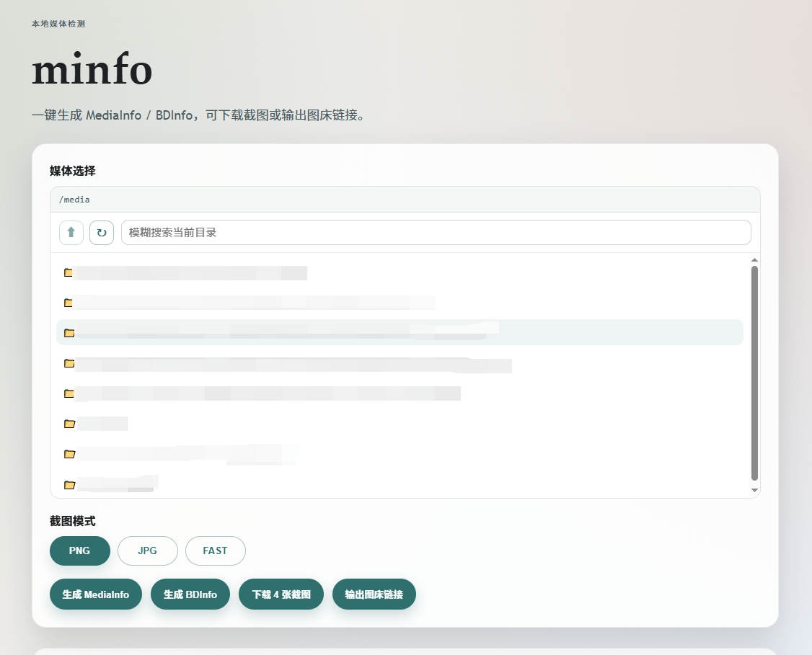
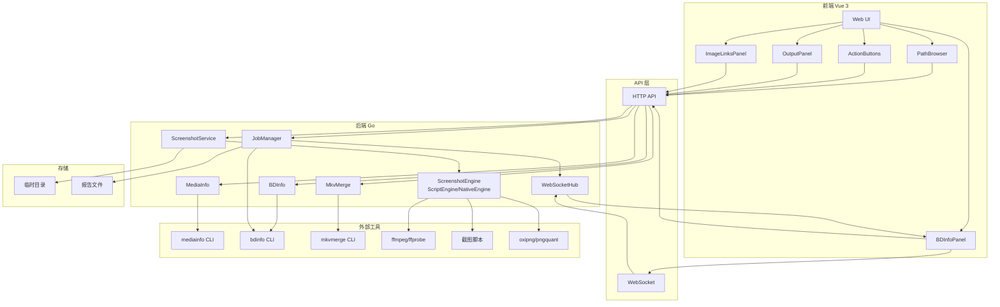
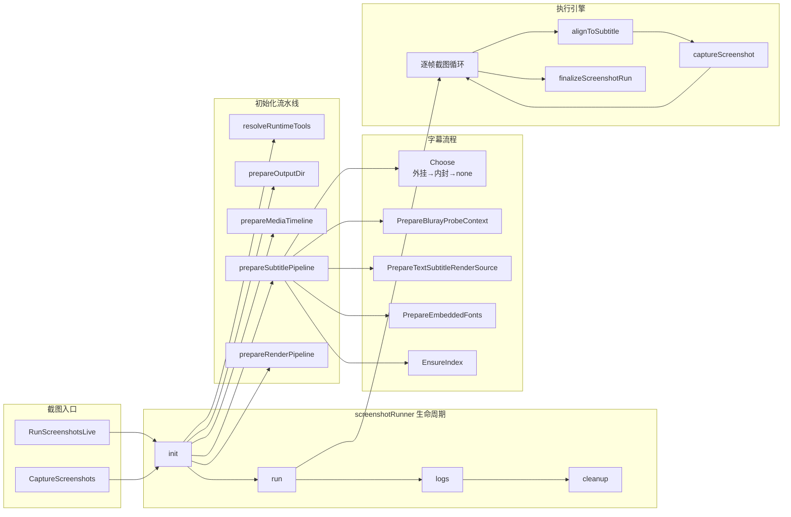

# MediaInfoWebUI

> 基于 [minfo](https://github.com/mirrorb/minfo) 改进的本地媒体信息检测 Web 工具

[](https://github.com/YEAHZERO/MediaInfoWebUI/pkgs/container/mediainfowebui)
[](https://github.com/YEAHZERO/MediaInfoWebUI/releases/tag/v1.5.5)

## 目录

- [项目介绍](#项目介绍)
- [功能特性](#功能特性)
- [快速开始](#快速开始)
  - [一行命令部署](#一行命令部署)
  - [docker-compose 部署](#docker-compose-部署推荐)
  - [本地构建运行](#本地构建运行)
  - [部署配置参考](#部署配置参考)
- [服务器更新指南](#服务器更新指南)
- [API 文档](#api-文档)
- [技术架构](#技术架构)
- [常见问题](#常见问题)
- [更新日志](#更新日志)
- [许可证](#许可证)

***

## 项目介绍

**MediaInfoWebUI** 是一个功能强大的本地媒体信息检测 Web 工具，主要功能：

- 📊 输出 MediaInfo 详细信息
- 🎬 输出 BDInfo 蓝光原盘信息
- 🎞️ 输出 mkvmerge 轨道信息（支持自动查找 BDMV 和 m2ts 文件）
- 📸 灵活的截图生成（支持自定义数量、字幕模式、两种输出格式）
- 🔗 图床链接生成与管理



***

## 功能特性

### 截图功能

- 🎯 **字幕模式控制**：支持"挂载字幕"和"纯净截图"两种模式
- 📦 **预生成下载**：ZIP 包预生成后返回下载链接，支持浏览器原生下载
- 📝 **结构化日志**：返回脚本执行详细日志，便于排查问题
- 🎨 **双格式支持**：PNG 和 JPG 两种输出格式
- 🔢 **截图数量自定义**：支持 1-10 张截图数量自定义

### 截图引擎 🚀

- 🎨 **色彩空间检测**：通过 ffprobe 自动检测视频色彩空间（SDR/HDR10/Dolby Vision）
- 🗜️ **截图压缩**：集成 oxipng（无损）和 pngquant（有损）自动压缩
- 🔧 **可插拔引擎架构**：默认使用轻量脚本引擎，可选启用 Go 原生引擎
- 🧩 **引擎工厂模式**：根据环境变量自动选择合适引擎，支持快捷回退
- 🖼️ **libplacebo HDR 色调映射**（native 标签）：支持 HDR10/HDR10+/Dolby Vision Profile 5/7/8
- ⏱️ **Coarse+Fine 双阶段 Seek**：粗定位关键帧 + 精定位解码帧，大文件 seek 速度提升 3-5 倍

### 字幕处理 🎬

- 🎯 **字幕对齐校准**：`SnapFromIndex` 全片字幕索引对齐，PGS/DVD 6s，文本 2s epsilon
- 🔍 **智能字幕选轨**：外挂字幕 → 内封字幕 → 无字幕三级降级，支持中英文优先级
- 🗂️ **蓝光字幕选轨**：bdsub 二进制解析 MPLS/CLPI → ffprobe 联合探测 → payload/bitrate 密度排序
- 🔄 **PGS 逐个段探测**：完整字幕索引扫描 + 可见性检测回溯
- 💿 **DVD 字幕支持**：dvdsub/dvd\_subtitle 自动检测与 bitmap 叠加，IFO/BUP 语言回退
- 📦 **嵌入式字体提取**：自动提取 MKV 附件字体用于 ASS 字幕渲染
- 📝 **ASS 文字字幕增强**：mkvextract 字体提取 + fontsdir 渲染

### BDInfo

- 📄 **输出模式切换**：支持"精简报告"（提取 `[code]` 块）和"完整报告"
- 🔍 **递归查找**：支持递归查找子目录中的 BDMV 和 ISO 文件
- 🎯 **智能 Playlist 选择**：自动推荐时长 > 10 分钟的主片 Playlist
- 🔄 **三种扫描模式**：自动选择 / 手动选择 / 整盘扫描
- 📜 **历史任务管理**：支持历史报告回顾与 WebSocket 实时进度推送
- 🎨 **交互式界面**：加载列表、全选/清空、推荐、主片标记、详细信息

### mkvmerge 轨道信息 🎞️

- 🔍 **智能文件查找**：自动查找 BDMV 目录和最大的 m2ts 文件
- 📁 **递归搜索**：支持在嵌套目录结构中查找视频文件
- 🎯 **多格式支持**：支持 mkv、m2ts、mp4 等多种视频格式
- 📊 **详细轨道信息**：显示视频、音频、字幕轨道详细信息

### 前端体验

- 🖥️ **输出面板分离**：MediaInfo/BDInfo 文本输出和图床链接分别显示
- 🔗 **图床链接管理**：支持链接预览、去重、删除、复制 BBCode
- 💾 **状态持久化**：使用 localStorage 保存用户配置，刷新页面不丢失
- 🔔 **通知提示**：操作结果和错误通过右上角 toast 提示
- 📱 **响应式设计**：适配不同屏幕尺寸

### 后端稳定性

- 🛡️ **ffprobe 增强**：双重 fallback（format → stream）和多行解析
- 🔒 **文件上传安全**：文件名清理和临时目录隔离，防止路径遍历攻击
- 📦 **脚本本地化**：截图脚本纳入版本控制，构建不再依赖外部网络
- 🇨🇳 **CJK 字体支持**：内置 `font-noto-cjk` + `fontconfig`，确保字幕正确渲染
- 🌐 **虚拟 ISO 路径**：支持 `ISO:/path!/inner` 格式

### 部署与配置

- 📂 **多路径挂载**：支持挂载多个独立的媒体目录
- 🚀 **远程部署**：一键部署到远程服务器
- 🌐 **网络优化**：Docker 构建使用 `--network=host` 解决网络问题

***

## 快速开始

### 环境要求

- Docker 20.10+
- 支持 x86\_64 / ARM64 架构
- 宿主机需加载 `loop` 模块（用于挂载 ISO/BDMV）

### 镜像标签

| 标签          | 描述       | 引擎        | BDInfoCLI | HDR 映射 | PNG 优化 | 适用场景                          |
| ----------- | -------- | --------- | :-------: | :----: | :----: | ----------------------------- |
| `:native` / `:latest` | 全功能版（推荐） | Native 引擎 |    ✅ 内置   |    ✅   |    ✅   | 完整功能，含 BDInfoCLI、HDR 映射、PNG 压缩 |

### 镜像说明

- **基础镜像**：基于 `ghcr.io/yeahzero/mediainfowebui:latest` 构建
- **构建策略**：从上一版镜像提取所有依赖，只覆盖修改的二进制文件
- **BDInfoCLI**：内置完整的 BDInfoCLI（从源码编译）
- **引擎**：Native 引擎，支持高级功能
- **HDR 映射**：支持 HDR→SDR 色彩转换（libplacebo）
- **PNG 优化**：支持 oxipng + pngquant 压缩
- **BDMV 字幕探测**：内置 `bdmv_subtitle_probe` 工具，增强蓝光原盘支持

> **镜像优化策略**：
> 1. 从上一版 `ghcr.io/yeahzero/mediainfowebui:latest` 镜像提取所有依赖
> 2. 只覆盖修改的二进制文件（BDInfo、bdmv_subtitle_probe、mediainfo）
> 3. 构建阶段（Go 编译器、Node.js、.NET SDK）不进入最终镜像

### 一行命令部署

> **重要**：启动新容器前务必先删除旧容器！

```bash
# 强制删除旧容器（非常重要！！！！）
docker rm -f mediainfo

# 然后启动新容器
docker run -d \
  --name mediainfo \
  --privileged \
  --network host \
  -e TZ=Asia/Shanghai \
  -e PORT=28888 \
  -e REQUEST_TIMEOUT=30m \
  -e MEDIAINFO_BIN=/usr/bin/mediainfo \
  -v /lib/modules:/lib/modules:ro \
  -v /path/to/media:/media:ro \
  --restart unless-stopped \
  ghcr.io/yeahzero/mediainfowebui:latest
```

### docker-compose 部署（推荐）

```yaml
services:
  mediainfo:
    image: ghcr.io/yeahzero/mediainfowebui:latest
    container_name: mediainfo
    privileged: true
    ports:
      - "28888:28888"
    environment:
      TZ: "Asia/Shanghai"
      PORT: "28888"
      REQUEST_TIMEOUT: "30m"
      MEDIAINFO_BIN: "/usr/bin/mediainfo"
      # ENABLE_NATIVE_ENGINE: "1"        # 启用 Native 引擎（仅 native 镜像）
      # SCREENSHOT_COMPRESS_THRESHOLD: "10485760"
      # SCREENSHOT_COMPRESS_STRATEGY: "auto"
    volumes:
      - /lib/modules:/lib/modules:ro
      - /path/to/media:/media:ro
    restart: unless-stopped
    healthcheck:
      test: ["CMD", "curl", "-f", "http://localhost:28888/api/version"]
      interval: 30s
      timeout: 10s
      retries: 3
```

```bash
docker compose up -d
```

### 本地构建运行

```bash
git clone https://github.com/YEAHZERO/MediaInfoWebUI.git
cd MediaInfoWebUI

# 构建 native 版本（推荐）
docker build --network=host --target native -t mediainfowebui:native .

# 或使用 make
make docker-native  # 构建 native 版本

# 运行
docker run -d --name mediainfo --privileged --network host \
  -e TZ=Asia/Shanghai -e PORT=28888 -e REQUEST_TIMEOUT=30m \
  -v /lib/modules:/lib/modules:ro \
  -v /path/to/media:/media:ro \
  --restart unless-stopped \
  mediainfowebui:native
```

> **构建网络问题**：如遇 `failed to create endpoint ... on network bridge: operation not supported`，务必加 `--network=host`。
> **网络问题解决方案**：确保使用标准 GitHub URL（github.com），避免使用镜像站点导致连接问题。

访问 `http://你的服务器IP:28888`

### 部署方式选择

你可以选择以下任意一种部署方式：

#### 方式一：一键自动部署（推荐）

提供自动识别环境并部署的脚本：

```bash
# 克隆仓库（如需要）
git clone https://github.com/YEAHZERO/MediaInfoWebUI.git
cd MediaInfoWebUI

# 一键部署（推荐）
./deploy.sh

# 自定义容器名和端口
./deploy.sh latest my-media-container 28888
```

**特点**：

- ✅ 自动检测 WSL 或服务器环境
- ✅ **智能路径查找**：按优先级搜索，支持智能识别有 docker/qb 文件夹的上级目录
- ✅ 自动选择正确的网络模式
- ✅ 彩色输出，友好提示

**智能路径查找优先级**：

1. **优先路径**：/home/liveup/ → /home/live/ → $HOME/ 下的 qbittorrent/downloads
2. **智能查找**：查找有 docker 或 qb 文件夹的用户目录下的下载文件夹
3. **后备路径**：常见路径如 /data/、/media/ 等

#### 方式二：手动 Docker 部署

如果需要完全自定义路径和配置，可以使用以下命令：

```bash
# 拉取镜像
docker pull ghcr.io/yeahzero/mediainfowebui:latest

# 服务器部署（使用 host 网络）
docker run -d --name mediainfo --privileged --network host \
  -e TZ=Asia/Shanghai -e PORT=28888 -e REQUEST_TIMEOUT=30m \
  -e MEDIAINFO_BIN=/usr/bin/mediainfo \
  -v /home/<your_username>/qbittorrent/downloads:/media:ro \
  --restart unless-stopped \
  ghcr.io/yeahzero/mediainfowebui:latest

# WSL 本地部署（使用端口映射）
docker run -d --name mediainfo --privileged -p 28888:28888 \
  -e TZ=Asia/Shanghai -e PORT=28888 -e REQUEST_TIMEOUT=30m \
  -e MEDIAINFO_BIN=/usr/bin/mediainfo \
  -v /home/<your_username>/qbittorrent/downloads:/media:ro \
  --restart unless-stopped \
  ghcr.io/yeahzero/mediainfowebui:latest
```

#### 方式三：Docker Compose 部署

使用项目提供的 docker-compose.yml 文件，适合更复杂的配置：

```bash
# 复制环境变量示例文件
cp .env.example .env

# 编辑 .env 文件，配置媒体路径和其他参数

# 启动服务
docker-compose up -d
```

#### 方式四：本地构建并运行

参考下方的"本地构建运行"部分。

### 本地构建运行

```bash
# 克隆仓库
git clone https://github.com/YEAHZERO/MediaInfoWebUI.git
cd MediaInfoWebUI

# 使用 Makefile 构建（推荐）
make build-native

# 或者手动构建（需 CGO + libplacebo-dev）
cd webui && npm install && npm run build
cd .. && CGO_ENABLED=1 go build -tags native -ldflags="-s -w" -o mediainfo ./cmd/mediainfo

# 运行
./mediainfo
```

### 浏览器强制刷新

如果修改前端后看不到文件列表，请尝试强制刷新浏览器缓存：

- Windows/Linux: `Ctrl + Shift + R`
- Mac: `Cmd + Shift + R`

### 部署配置参考

| 环境变量                            | 默认值                  | 说明                                  |
| ------------------------------- | -------------------- | ----------------------------------- |
| `PORT`                          | `28888`              | 服务端口                                |
| `TZ`                            | `Asia/Shanghai`      | 时区                                  |
| `REQUEST_TIMEOUT`               | `30m`                | 请求超时（大文件建议 `30m`）                   |
| `ENGINE_TYPE`                   | `native`             | 截图引擎：`native`（原生引擎）                 |
| `ENABLE_NATIVE_ENGINE`          | `1`                  | 启用原生截图引擎                          |
| `SCREENSHOT_COMPRESS_THRESHOLD` | `10485760`           | 截图压缩阈值（字节）                          |
| `SCREENSHOT_COMPRESS_STRATEGY`  | `auto`               | 压缩策略：`lossless`/`lossy`/`auto`      |
| `OXIPNG_BIN`                    | `oxipng`             | oxipng 路径                           |
| `PNGQUANT_BIN`                  | `pngquant`           | pngquant 路径                         |
| `MEDIAINFO_BIN`                 | `/usr/bin/mediainfo` | MediaInfo CLI 路径                    |
| `MKVMERGE_BIN`                  | `mkvmerge`           | mkvmerge 路径（可选，镜像未内置需自行安装）          |

***

## 服务器更新指南

### 使用 GHCR 远程镜像（推荐）

```bash
# 拉取最新镜像并重启
docker pull ghcr.io/yeahzero/mediainfowebui:latest
docker rm -f mediainfo
docker run -d --name mediainfo --privileged --network host \
  -e TZ=Asia/Shanghai -e PORT=28888 -e REQUEST_TIMEOUT=30m \
  -e MEDIAINFO_BIN=/usr/bin/mediainfo \
  -v /lib/modules:/lib/modules:ro \
  -v /path/to/media:/media:ro \
  --restart unless-stopped \
  ghcr.io/yeahzero/mediainfowebui:latest
```

### 本地构建更新

```bash
cd /path/to/MediaInfoWebUI
git pull origin main

# 停止并清理
docker stop mediainfo && docker rm mediainfo
docker rmi -f mediainfowebui:latest

# 重新构建（可省略 --no-cache 以加速）
docker build --network=host -t mediainfowebui:latest .

# 启动
docker run -d --name mediainfo --privileged --network host \
  -e TZ=Asia/Shanghai -e PORT=28888 -e REQUEST_TIMEOUT=30m \
  -v /lib/modules:/lib/modules:ro \
  -v /path/to/media:/media:ro \
  --restart unless-stopped \
  mediainfowebui:latest
```

### 源码编译（开发调试）

```bash
# 安装依赖
go mod tidy

# Native 引擎（需 CGO + libplacebo-dev）
CGO_ENABLED=1 go build -tags native -ldflags="-s -w -X mediainfo/internal/version.Version=$(date +%Y%m%d)" -o mediainfo ./cmd/mediainfo

# 直接运行
export PORT=28888 MEDIA_ROOTS=/path/to/media REQUEST_TIMEOUT=30m
./mediainfo
```

### 验证更新

```bash
docker images | grep mediainfowebui   # 确认镜像时间
docker ps | grep mediainfo            # 确认容器运行
curl http://localhost:28888            # 测试服务
docker logs mediainfo --tail 20       # 查看启动日志
```

> **端口说明**：minfo（原项目）默认 28080，本项目默认 28888，可同时运行不冲突。

***

## API 文档

### 基础 API

| 端点                     | 方法   | 说明               |
| :--------------------- | :--- | :--------------- |
| `/api/mediainfo`       | POST | 获取 MediaInfo 信息  |
| `/api/bdinfo`          | POST | 获取 BDInfo 信息     |
| `/api/mkvmerge/tracks` | POST | 获取 mkvmerge 轨道信息 |
| `/api/screenshots`     | POST | 生成截图             |
| `/api/path`            | GET  | 路径浏览             |
| `/api/version`         | GET  | 获取版本信息           |

### BDInfo 任务 API ✨

| 端点                       | 方法   | 说明                |
| :----------------------- | :--- | :---------------- |
| `/api/bdinfo/playlists`  | POST | 获取 Playlist 列表和推荐 |
| `/api/bdinfo/jobs`       | GET  | 获取历史任务列表          |
| `/api/bdinfo/job/create` | POST | 创建扫描任务            |
| `/api/bdinfo/job`        | GET  | 获取任务详情            |
| `/api/bdinfo/report`     | GET  | 获取扫描报告            |
| `/api/bdinfo/ws`         | GET  | WebSocket 实时进度    |

***

## 技术架构

> 以下架构图使用 Mermaid 格式，支持 GitHub/GitLab 等平台渲染。

### 整体系统架构


```mermaid
graph TB
    subgraph "前端 Vue 3"
        UI[Web UI]
        PB[PathBrowser]
        AB[ActionButtons]
        BP[BDInfoPanel]
        OP[OutputPanel]
        IL[ImageLinksPanel]
    end

    subgraph "API 层"
        API[HTTP API]
        WS[WebSocket]
    end

    subgraph "后端 Go"
        MI[MediaInfo]
        BI[BDInfo]
        MK[MkvMerge]
        SS[ScreenshotService]
        SE[ScreenshotEngine<br/>ScriptEngine/NativeEngine]
        JM[JobManager]
        WH[WebSocketHub]
    end

    subgraph "外部工具"
        MED[mediainfo CLI]
        BDI[bdinfo CLI]
        MKV[mkvmerge CLI]
        FFM[ffmpeg/ffprobe]
        SCP[截图脚本]
        OXI[oxipng/pngquant]
    end

    subgraph "存储"
        TMP[临时目录]
        REP[报告文件]
    end

    UI --> PB & AB & BP & OP & IL
    PB & AB & BP & OP & IL --> API
    BP --> WS
    API --> MI & BI & MK & SS & JM
    WS --> WH
    MI --> MED
    BI --> BDI
    MK --> MKV
    SS --> SE
    SE --> FFM & SCP & OXI
    JM --> BDI & WH
    WH --> BP
    JM --> REP
    SS --> TMP
```

### 截图 Runner 架构（v1.5.0 🚀）


```mermaid
graph LR
    subgraph "截图入口"
        E[RunScreenshotsLive]
        C[CaptureScreenshots]
    end

    subgraph "screenshotRunner 生命周期"
        I[init]
        R[run]
        L[logs]
        CL[cleanup]
    end

    subgraph "初始化流水线"
        T[resolveRuntimeTools]
        O[prepareOutputDir]
        M[prepareMediaTimeline]
        S[prepareSubtitlePipeline]
        P[prepareRenderPipeline]
    end

    subgraph "字幕流程"
        CH[Choose<br/>外挂→内封→none]
        BL[PrepareBlurayProbeContext]
        TX[PrepareTextSubtitleRenderSource]
        FN[PrepareEmbeddedFonts]
        IX[EnsureIndex]
    end

    subgraph "执行引擎"
        LOOP[逐帧截图循环]
        AL[alignToSubtitle]
        CAP[captureScreenshot]
        SUM[finalizeScreenshotRun]
    end

    E & C --> I --> T & O & M & S & P
    S --> CH & BL & TX & FN & IX
    I --> R --> LOOP --> AL --> CAP
    CAP --> LOOP
    LOOP --> SUM
    R --> L --> CL
```

***

## 常见问题

### Q: 容器启动后无法访问 Web 界面？

**A**: 检查端口映射和容器日志：

```bash
docker ps | grep mediainfo
docker logs mediainfo
netstat -tlnp | grep 28888
```

### Q: WebSocket 连接失败？

**A**: 如果使用反向代理（如 nginx），需要正确配置 WebSocket 支持：

```nginx
location /api/bdinfo/ws {
    proxy_pass http://localhost:28888;
    proxy_http_version 1.1;
    proxy_set_header Upgrade $http_upgrade;
    proxy_set_header Connection "upgrade";
    proxy_set_header Host $host;
}
```

### Q: 截图生成失败？

**A**: 检查容器是否以 `--privileged` 模式运行：

```bash
docker inspect mediainfo | grep Privileged
# 应输出 "Privileged": true
```

### Q: 截图中文字幕显示为方块？

**A**: 最新镜像已内置 CJK 字体，请确保使用 `latest` 或 `v1.0.0+` 版本。

### Q: Web 界面显示"读取路径失败"？

**A**: 检查挂载路径是否正确，以及宿主机目录权限：`ls -la /path/to/media`

### Q: Docker 构建网络超时？

**A**: 使用 `--network=host` 参数构建。

***

## 更新日志

### \[1.5.5] - 2026-05-14

**简化 - 移除 light 版本**

- 只保留 native/latest 标签
- 移除脚本引擎和相关脚本文件
- 增强蓝光原盘支持（BDMV 字幕探测工具）
- 支持 linux/amd64 和 linux/arm64 架构
- 使用 --network=host 参数构建和部署
- 使用标准 GitHub URL（github.com）

**修复 - 版本号同步**

- 修复 internal/httpapi/handlers/version.go 中 BuildVersion 与实际版本不一致的问题

### \[1.5.4] - 2026-05-12

**新增 - BDInfoCLI 完整集成**

- **native 版本**：内置完整 BDInfoCLI（从 mirrorb/BDInfoCLI 构建），无需额外挂载
- **Dockerfile 优化**：参考 minfo 项目的 BDInfo 构建流程，使用 .NET 9 SDK 编译

**新增 - 镜像体积优化**

- 使用 `font-wqy-zenhei`（约 16MB）替代 `font-noto-cjk`（约 100MB），节省 \~84MB
- 合并 RUN 指令减少镜像层数
- 清理 `/var/cache/apk/*`、`/usr/share/doc`、`/usr/share/man`、`/usr/share/info`

**文档更新**

- 更新镜像标签选择表格，添加 BDInfoCLI、HDR 映射、PNG 优化列
- 添加镜像版本区别说明
- 添加 BDInfoCLI 使用说明

**镜像大小**

| 版本                     | 压缩后     | 解压后     |
| ---------------------- | ------- | ------- |
| native/latest          | \~120MB | \~400MB |

**优化说明**：

| 优化项                                    | 节省空间   |
| -------------------------------------- | ------ |
| 字体替换 (font-noto-cjk → font-wqy-zenhei) | \~84MB |
| 文档清理 (/usr/share/doc/man/info)         | \~30MB |
| 镜像层优化                                  | \~10MB |

### \[1.5.3] - 2026-05-12

**新增 - 字幕对齐校准功能完全移植**

- **字幕对齐核心重构**：`alignToSubtitle` 完整实现，支持 PGS/DVD 位图字幕可见性检测 + 全片字幕索引对齐
- **新增文件**：`capture_bitmap.go`（位图字幕探测与渲染）、`capture_filters.go`（滤镜链构建）
- **核心函数移植**：
  - `resolveUniqueScreenshotSecond` 完整实现，支持从字幕索引获取唯一时间点
  - `uniqueAlignedCandidatesFromSubtitleIndex` 新增，按距离排序的字幕候选列表
  - `acceptBitmapSubtitleCandidate` 新增，验证位图字幕可见性 + 回溯窗口调整
  - `findNearestVisibleBitmapIndexedCandidate` 新增，搜索最近可见字幕
  - `logAlignedSubtitleIndexCandidate` 新增，记录全片字幕索引命中结果
- **工具函数新增**：`ScreenshotSecond`、`SecToHMSMS`、`floatDiffGT`
- **字幕对齐精度**：epsilon 为 0.5s，支持位图字幕回溯窗口自动调整（short: renderBack → long: coarseBackPGS）

**新增 - 截图实时进度显示**

- **TaskProgressBar 组件**：从 minfo-master 移植，支持百分比、阶段、详情、计数显示
- **异步任务轮询**：`waitForScreenshotJob` + `fetchScreenshotJob` + `createScreenshotJob`
- **进度管理**：`setTaskProgress`、`clearTaskProgress`、`normalizeTaskProgressPayload`、`buildFallbackTaskProgress`
- **UI 集成**：OutputPanel 和 ImageLinksPanel 均支持进度条显示

**新增 - favicon 和 GitHub 链接**

- **favicon.svg**：minfo 项目主题图标
- **AppHeader 组件**：右上角 GitHub 链接图标 + 链接

**变更 - Docker 镜像 mkvtoolnix 移除**

- 所有镜像阶段（light/standard/native）均不再预安装 mkvtoolnix
- 支持通过 `MKVMERGE_BIN` 环境变量自定义外部路径

### \[1.5.2] - 2026-05-12

**文档优化**

- 更新日志优化：去除重复内容，明确说明 v1.5 前的功能记录与实际完整实现的区别
- 版本号同步至 v1.5.2

### \[1.5.1] - 2026-05-12

**修复**

- **字幕对齐校准（完整实现）**：`alignToSubtitle` 此前为空操作（直接返回请求值），现已连接 `SnapFromIndex` 全片字幕索引，PGS/DVD 位图字幕使用 `SearchBack`（6s），文本字幕使用 2s epsilon 进行最近字幕对齐
- **DVD 截图 IFO→VOB 链路（完整实现）**：`captureScreenshot` 此前始终使用原始输入路径，现检测 `DVDResult.SelectedVOBPath` 并自动切换为 VOB 文件路径，完成 IFO→VOB 完整数据链路
- **Job 并发控制**：新增 `maxScreenshotJobSlots=4` 基于 channel semaphore 的并发限制，防止无限 goroutine 创建

**优化**

- libplacebo 回退机制验证完毕：`captureWithLibplaceboFallback` 崩溃检测 + `buildFallbackToneMappingFilter` 自动回退，覆盖 HDR10/HLG/Dolby Vision
- 截图字幕对齐新增日志输出：`[信息] 字幕对齐: 请求 X.XXs → 对齐到字幕 X.XXs`

### \[1.5.0] - 2026-05-11

**重构 - 截图 Runner 架构（minfo-master 移植）**

移植 minfo-master 的 Runner 架构，提供更清晰的截图流程编排：

- **Runner 初始化流水线**：工具解析 → 输出目录 → 媒体时间线 → 字幕流水线 → 渲染管线
- **字幕流程重构**：
  - 统一 `Choose()` 入口：外挂字幕 → 内封字幕 → 无字幕三级降级
  - 蓝光字幕上下文探测：bdsub（MPLS/CLPI）元数据 + ffprobe 联合补充
  - PGS/DVD 字幕逐个段可见性检测与回溯
  - 嵌入式字体自动提取（mkvextract）
- **截图执行循环**：逐帧对齐 → 字幕时间校准 → 唯一秒去重 → capture + 日志汇总
- **统一进度系统**：`taskprogress` 包提供标准化的进度日志格式

**新增 - 蓝光/DVD 全面支持**

- Blu-ray 字幕选轨：bdsub 二进制解析 MPLS → ffprobe 补充 → payload/bitrate 密度排序
- DVD 全链路：mediainfo 探测 → VOB 选片 → IFO 解析 → DVD 字幕渲染
- `EnsureIndex` PGS 字幕索引扫描 + SubtitleSpan 可见性校验
- DVD MediaInfo 轨道解析与语言回退（IFO/BUP）

**新增 - 基础模块**

- `internal/version` 版本包，支持 `go build -ldflags` 注入版本号
- `taskprogress` 统一进度格式（`FormatStep`/`FormatPercent`/`ParseLogLine`）
- `dvdinfo` DVD mediainfo 探测与解析
- `pixhost` Go 原生图床上传（替代 Shell 脚本）
- `source` 视频源路径工具（DVD/Bluray 识别、Playlist 排序）
- `delivery` 截图文件打包交付

**优化**

- 删除 `runner_subtitle_alignment.go`，合并到 `runner_log.go`
- `SubtitleState` 中 `DVDMediaInfoResult` 改为指针字段 `DVDResult`
- macOS 编译优化：`-tags native` 在非 Linux 平台自动回退

**修复**

- Runner 编译错误：`PrepareBlurayProbeContext` 改为方法调用、`SubtitleBitmapVisibilityStepPercent` 移除、`captureScreenshot` 正确处理 `(*CaptureResult, error)` 返回

### \[1.4.2] - 2026-05-10

**修复**

- 字幕流索引问题：ffmpeg subtitles 滤镜需要相对索引
- MediaInfo CLI 路径问题：`ENV MEDIAINFO_BIN=/usr/bin/mediainfo`
- 日志显示从 `localhost` 改为 `0.0.0.0`

### \[1.4.0] - 2026-05-10

**新增**

- 字幕截图体积优化：SDR 用 8-bit，HDR 用 10-bit
- 截图文件大小显示：`ScreenshotFileInfo` 结构
- Docker 镜像全量安装：同时包含标准版和 native 版

**重构**

- 命名统一为 mediainfo
- 端口默认 28888

### \[1.3.0] - 2026-05-10

**新增**

- 实时进度系统：Heartbeat goroutine 每 500ms 推送
- Coarse+Fine 双阶段 Seek：大文件 seek 提升 3-5 倍
- 字幕子系统完整升级：PGS/DVD/ASS 渲染
- DVD 全支持（NativeEngine）
- libplacebo HDR/DV 色彩映射

### \[1.2.0] - 2026-05-10

**新增**

- 可插拔 ScreenshotEngine 架构
- 色彩空间检测（SDR/HDR10/Dolby Vision）
- 截图压缩策略（oxipng/pngquant）

**重构**

- 路径解析策略模式（PathType 枚举 + PathResolver 接口）

### \[1.1.4] - 2026-04-04

**变更**

- 移除所有硬编码本地路径
- 统一通用路径示例

### \[1.1.3] - 2026-04-04

**新增**

- BDInfo 高级交互式界面
- Playlist 列表管理、主片标记

### \[1.1.0] - 2026-04-04

**新增**

- mkvmerge 轨道信息查询
- BDInfo 递归查找
- 版本信息自动获取

### \[1.0.0] - 2026-04-02

**新增**

- BDInfo 高级功能、WebSocket 实时推送
- mkvmerge 轨道信息、截图数量自定义
- BDMV 字幕探测（bdsub）

***

## 感谢

本项目基于 [minfo](https://github.com/mirrorb/minfo) 项目改进，在此特别感谢：

- **mirrorb** - minfo 项目作者，提供了优秀的媒体信息检测框架
- **BDInfoCLI** - 蓝光原盘信息检测工具
- 所有为项目做出贡献的开发者和用户

***

## 许可证

本项目基于原 [minfo](https://github.com/mirrorb/minfo) 项目改进，采用相同的开源许可证。详见 [LICENSE](LICENSE) 文件。

***

## 相关链接

- [GitHub 仓库](https://github.com/YEAHZERO/MediaInfoWebUI)
- [GitHub Container Registry](https://github.com/YEAHZERO/MediaInfoWebUI/pkgs/container/mediainfowebui)
- [原版 minfo 项目](https://github.com/mirrorb/minfo)
- [问题反馈](https://github.com/YEAHZERO/MediaInfoWebUI/issues)

***

*最后更新：2026-05-13*
